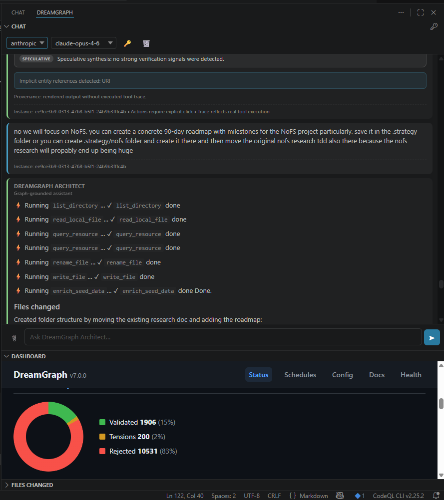

# DreamGraph v7.0 — El Alarife

[](https://safeskill.dev/scan/mmethodz-dreamgraph)

<p align="center">
  
</p>

**The autonomous cognitive layer for sovereign development.**

DreamGraph is a model-agnostic, graph-grounded development agent. It replaces brute-force context dumping with architectural discipline — shipping the 2.4 kB of entity-specific knowledge that matters instead of the 800 kB of raw source that costs. Your project's logic stays persistent in the Graph regardless of which LLM you plug in.

> *Grounded in the Graph. Built for the Master Builder.*

---

## The Sovereign Advantage

| Principle | What it means |
|---|---|
| **Model Agnostic** | Hot-swap providers (OpenAI, Anthropic, Ollama) or local models mid-flight. Context stays in the Graph, not the session. |
| **Graph-Grounded Reasoning** | Surgical context selection. Entity-specific data, not full source files. Proven 10–30× cost reduction on models like Claude Opus 4.6. |
| **Autonomous Normalization** | Background Dream Cycles map and resolve architectural tensions continuously. |
| **100% Local Privacy** | Your database, your daemon, your keys. Sovereign by design. |
| **Governed Automation** | ADR-backed guard rails ensure changes are compliant by design. |
| **Explainable AI** | Every edge has confidence, evidence, decay — and clear provenance. |

---

## How It Works — Six Layers

### 1. Graph — the source of truth
Seed, scan, and enrich a knowledge graph with features, workflows, data models, validated edges, and source anchors. The graph is authoritative; everything else orbits it.

### 2. MCP — the connective tissue
68 tools and 26 resources via the Model Context Protocol. The daemon delegates to scanners, extractors, and LLMs while keeping the graph consistent and traceable.

### 3. Daemon — the cognitive core
Dream cycles generate hypotheses, validate/promote/decay edges, and converge on truth. 10 dream strategies auto-adapt. ADR recording and guard rails govern change. The 5-state cognitive machine (AWAKE → REM → NORMALIZING → NIGHTMARE → LUCID) enforces isolation between speculation and fact.

### 4. CLI — instance management
The `dg` command manages the full lifecycle: create, attach, start, scan, schedule, export, fork, archive, destroy. See [CLI Reference](#cli-reference) below.

### 5. Dashboard — the living memory
Zero-dependency browser UI at `http://localhost:<port>/` — cognitive status, schedule management, runtime LLM config, and auto-generated knowledge docs with Mermaid diagrams.

### 6. Extension — the agent in your editor
Native VS Code sidebar with Chat, Dashboard, and Files Changed panels. The Architect LLM reasons over the graph first, makes targeted edits with verification, and syncs the graph so knowledge and code never drift. **Change model and provider mid-flight without losing context** — the graph persists independently of any LLM session.

<p align="center">
  
</p>

---

## Getting Started

### Prerequisites

- **Node.js** ≥ 18 · **Git** · An LLM API key (OpenAI, Anthropic, or Ollama for local)

### Install

```powershell
# Windows
git clone https://github.com/mmethodz/dreamgraph.git
cd dreamgraph
.\scripts\install.ps1 -Force
```

```bash
# Linux / macOS
git clone https://github.com/mmethodz/dreamgraph.git
cd dreamgraph
bash scripts/install.sh
```

This builds the server, installs the `dg` CLI globally, and **automatically installs the VS Code extension** if VS Code is detected. On a fresh machine, the installer also bootstraps required build dependencies such as the TypeScript compiler. If VS Code is not installed, DreamGraph still installs successfully for CLI, MCP server, and dashboard use.

### Onboard a Project

```bash
dg init my-project --template default     # Create an instance from the selected template (default: ~/.dreamgraph/templates/default)
dg attach my-project /path/to/your/repo   # Bind to your project
dg start my-project --http                # Start the daemon
```

You can prepare your own named presets by copying `~/.dreamgraph/templates/default/` to another directory such as `~/.dreamgraph/templates/openai/`, then running `dg init --template openai`.

Configure your LLM — either edit `~/.dreamgraph/<instance-uuid>/config/engine.env` or open the web dashboard at `http://localhost:<port>/config`. New instances now seed `config/engine.env` from `~/.dreamgraph/templates/<template>/config/engine.env` when available (default template: `default`), then fall back to the repository template, and finally to a built-in programmatic scaffold if no template file is available.

Repository configuration is automatic in instance mode:
- `project_root` is the attached working project for the instance
- `repos` is the named repository map available to MCP code/git/scan tools
- on startup, DreamGraph builds the runtime repo registry from `config/mcp.json`, then merges `DREAMGRAPH_REPOS` from the instance `engine.env`, and finally auto-registers the attached `project_root` as a repo if it is not already present
- this means repos configured for the instance are automatically available to graph scans and code tools after restart, with no extra operator steps

Then scan:

```bash
dg scan my-project                        # Scan, dream, discover ADRs, schedule follow-ups
code /path/to/your/repo                   # Extension auto-connects
```

The scan populates the knowledge graph, runs an initial dream cycle, discovers implicit ADRs, and schedules follow-up dreams. Open the Chat panel and start asking immediately.

### Build a Comprehensive Graph

For graph creation and multi-pass enrichment, **use DreamGraph Architect**.

Why:
- it can continue when scans are partial or expensive
- it can suggest the next best action
- it can build a comprehensive graph incrementally across repos
- it can combine structural evidence with deeper semantic enrichment over time

A useful operating model is:
- `dg scan` for mechanical scanning
- `dg enrich` for graph coverage from the CLI
- `dg curate` for graph quality cleanup from the CLI
- **DreamGraph Architect** for guided graph creation, enrichment, and next-step recommendations

### Onboard the Extension

1. The extension installs automatically via `install.ps1` / `install.sh`.
2. Open your project in VS Code — the extension discovers the instance and connects.
3. The DreamGraph icon appears in the activity bar (left sidebar). Click it to open Chat, Dashboard, and Files Changed.
4. Set your API key: `Ctrl+Shift+P` → **DreamGraph: Set Architect API Key**.
5. Configure model: VS Code Settings → `dreamgraph.architect.provider` / `dreamgraph.architect.model`.

You can change provider and model at any time — the graph-grounded context is independent of the LLM session, so switching from Sonnet to Opus (or to a local Ollama model) loses nothing.

> **Note:** The daemon does NOT auto-scan on startup. You must configure LLM settings first, then run `dg scan` to bootstrap the knowledge graph.

### Configure LLM

```bash
# Engine dreamer / normalizer (daemon-side) — set in instance config
# ~/.dreamgraph/<instance-uuid>/config/engine.env
DREAMGRAPH_LLM_PROVIDER=openai
DREAMGRAPH_LLM_URL=https://api.openai.com/v1
DREAMGRAPH_LLM_API_KEY=**** Extension Architect (VS Code-side)
# Settings → dreamgraph.architect.provider / model
# API key → Ctrl+Shift+P → DreamGraph: Set Architect API Key
```

Notes:

- `engine.env` values are loaded per instance and override global environment variables.
- `dg init` supports `--template <name>` and defaults to `default`.
- Named templates resolve in this order: `~/.dreamgraph/templates/<template>` → repository `templates/<template>` → built-in scaffold.
- New instances seed `config/engine.env` from the selected template's `config/engine.env` when it exists.
- The install scripts copy the repository `templates/default/` tree into the global `~/.dreamgraph/templates/default/` directory. Existing templates are only overwritten when `-Force` / `--force` is used or the user explicitly confirms overwrite.
- Users can create additional templates such as `openai` or `anthropic` by copying and renaming `~/.dreamgraph/templates/default/`, then running `dg init --template <name>`.
- When introducing new engine env variables, update the default engine.env template so new instances expose them as commented-out examples.
- The daemon supports separate Dreamer and Normalizer model settings.
- `DREAMGRAPH_LLM_MODEL`, `DREAMGRAPH_LLM_TEMPERATURE`, and `DREAMGRAPH_LLM_MAX_TOKENS` can still be used as base defaults; Dreamer/Normalizer-specific values override them when present.
- Full setup guidance: [docs/setup-llm.md](docs/setup-llm.md)

### Anthropic Architect models and Claude Opus 4.7

The VS Code Architect supports Anthropic model selection directly from settings and the chat model picker.

- Default Anthropic Architect model remains **`claude-opus-4-6`** for now.
- **`claude-opus-4-7`** is available as a standard selectable model without using `Custom...`.
- Anthropic-specific settings are available under:
  - `dreamgraph.architect.anthropic.effort`
  - `dreamgraph.architect.anthropic.adaptiveThinking`
  - `dreamgraph.architect.anthropic.showThinkingSummary`

Recommended starting point:

- **Opus 4.6** → `high`
- **Opus 4.7** → `xhigh` for coding and agentic work, per Anthropic guidance

Current DreamGraph behavior:

- Opus 4.6 remains the default selection in the dropdown.
- Opus 4.7 is selectable and uses the newer Anthropic request shape.
- If `xhigh` is configured while using Opus 4.6, DreamGraph clamps it to `high` for compatibility.
- For Opus 4.7, DreamGraph can send adaptive thinking and optionally request summarized thinking visibility.

Important Opus 4.7 migration notes:

- Anthropic removed extended thinking budgets for Opus 4.7. Use `thinking: { type: "adaptive" }` instead of old `budget_tokens`-based thinking.
- Anthropic removed non-default sampling controls on Opus 4.7. Avoid sending non-default `temperature`, `top_p`, or `top_k` values.
- Thinking text is omitted by default on Opus 4.7 unless explicitly opted back in; use `dreamgraph.architect.anthropic.showThinkingSummary` if you want visible summarized reasoning progress.
- Opus 4.7 supports higher-resolution images automatically and may use significantly more image tokens on vision-heavy workloads.
- Opus 4.7 may use more text tokens than Opus 4.6, so re-check token budgets and output limits for long agentic traces.

For migration details, see Anthropic's guide:

- https://platform.claude.com/docs/en/about-claude/models/migration-guide#migrating-to-claude-opus-4-7

### Schedule Recurring Dreams

```bash
dg schedule my-project --add --name "nightly" --action dream_cycle --type interval --interval 300
```

---

## CLI Reference

| Command | Description |
|---|---|
| `dg init <name>` | Create a new instance |
| `dg attach <name> <path>` | Bind an instance to a project directory |
| `dg detach <name>` | Unbind from a project |
| `dg start <name> --http` | Start the HTTP daemon |
| `dg stop <name>` | Stop the daemon |
| `dg restart <name>` | Restart the daemon |
| `dg status [name]` | Show instance status, cognitive state, daemon info |
| `dg scan <name>` | Trigger a full project scan on a running instance |
| `dg enrich <name>` | Expand graph coverage from the CLI |
| `dg curate <name>` | Improve graph signal quality from the CLI |
| `dg schedule <name>` | List dream schedules |
| `dg schedule <name> --add` | Add a new dream schedule (interval, cron, cycle-based, idle-triggered) |
| `dg schedule <name> --run <id>` | Force-run a schedule immediately |
| `dg schedule <name> --pause <id>` | Pause a schedule |
| `dg schedule <name> --resume <id>` | Resume a paused schedule |
| `dg schedule <name> --delete <id>` | Delete a schedule |
| `dg instances list` | List all instances |
| `dg instances switch <name>` | Set the active instance |
| `dg export <name> --format snapshot` | Export full instance data |
| `dg export <name> --format docs` | Export living documentation |
| `dg export <name> --format archetypes` | Export anonymized archetypes for federation |
| `dg fork <name> --name <new>` | Copy an instance with a new UUID |
| `dg archive <name>` | Archive an instance |
| `dg destroy <name> --confirm` | Permanently delete an instance |
| `dg migrate` | Migrate legacy flat `data/` to UUID instance |

---

## VS Code Extension

The DreamGraph sidebar gives you one-click access to the full cognitive engine.

### Sidebar Panels

| Panel | Purpose |
|---|---|
| **Chat** | Talk to the Architect — an agentic LLM with access to all 68 MCP tools. It reads your code, queries the graph, runs dream cycles, and explains insights. Streams responses in real time. |
| **Dashboard** | Live cognitive status, health monitoring, graph signal. One-click access to the full web dashboard. |
| **Files Changed** | Tracks every file the Architect creates or modifies. Click to open, right-click to reveal or copy path. |

### Key Commands

| Command | What it does |
|---|---|
| `DreamGraph: Open Chat` | Focus the Chat panel |
| `DreamGraph: Start/Stop Daemon` | Control the daemon from VS Code |
| `DreamGraph: Switch Instance` | Quick-pick between instances |
| `DreamGraph: Explain File` | Architect explains the active file using graph context |
| `DreamGraph: Check ADR Compliance` | Verify the active file against ADRs |
| `DreamGraph: Show Graph Context` | View graph signal for the current file |
| `DreamGraph: Set Architect API Key` | Store your API key in VS Code's secret storage |

### Why It Saves You Money

Traditional AI coding assistants dump entire source files into the LLM context — 50–800 kB per request. DreamGraph's Graph RAG assembles **entity-specific context** (features, edges, data models, tensions) that typically fits in 1–5 kB. On models like Claude Opus 4.6 at $15/M input tokens, this is a **10–30× cost reduction** per interaction with better results, because the model gets precisely the knowledge it needs instead of parsing irrelevant code.

---

## Cognitive Capabilities (14)

| Capability | What it does |
|---|---|
| **Dream Cycles** | 10 auto-adapting strategies generate and validate knowledge graph edges |
| **Causal Reasoning** | Discovers cause→effect chains across entities |
| **NIGHTMARE Scanning** | Adversarial self-attack — finds vulnerabilities before they find you |
| **Temporal Analysis** | Predicts where tensions will emerge based on historical patterns |
| **Metacognition** | Self-analyzes strategy performance and auto-tunes thresholds |
| **Event-Driven Cognition** | Reacts to git pushes, CI/CD signals, runtime anomalies |
| **Dream Scheduling** | Policy-driven automation (interval, cron, cycle-based, idle-triggered) |
| **System Narratives** | Generated stories of how understanding evolved |
| **Continuous Narrative** | Auto-accumulated autobiography with diff chapters and weekly digests |
| **Lucid Dreaming** | Interactive hypothesis exploration — human + system co-creation |
| **Federation** | Exports anonymized archetypes so projects learn from each other |
| **Intervention Plans** | Concrete remediation steps from high-urgency tensions |
| **Runtime Awareness** | Queries live metrics (OpenTelemetry, Prometheus) and correlates with graph |
| **Graph RAG** | Token-budgeted knowledge injection for any LLM interaction |

---

## MCP Interface

**68 tools** · **26 resources** via the Model Context Protocol.

| Category | Count | Examples |
|---|---|---|
| **Cognitive** | 28 | `dream_cycle`, `nightmare_cycle`, `cognitive_status`, `get_dream_insights` |
| **Sense & Knowledge** | 23 | `scan_project`, `read_source_code`, `git_log`, `query_db_schema` |
| **Documentation** | 8 | `export_living_docs`, `record_architecture_decision`, `generate_visual_flow` |
| **Discipline** | 9 | `discipline_start_session`, `discipline_transition`, `discipline_verify` |
| **Resources** | 26 | `dream://graph`, `dream://tensions`, `dream://status`, `system://features` |

Full parameter tables: [docs/tools-reference.md](docs/tools-reference.md)

---

## Web Dashboard

| Page | What it shows |
|---|---|
| `/` | Cognitive status — state, cycle count, graph stats, tensions, recent dreams |
| `/health` | Daemon health, LLM provider status, uptime |
| `/schedules` | Dream schedules with run/pause/edit controls |
| `/config` | Runtime LLM configuration — change provider, model, and keys |
| `/docs` | Rendered knowledge graph documentation |

---

## Architecture

```
+------------------------------------------------------+
|                    VS Code Extension                  |
|  +--------+  +-----------+  +----------------------+ |
|  |  Chat  |  | Dashboard |  |  Files Changed       | |
|  +---+----+  +-----+-----+  +----------+-----------+ |
|      |              |                   |              |
|      +----------+---+-------------------+              |
|                 |  MCP over HTTP                        |
+-----------------+--------------------------------------+
                  |
+-----------------v--------------------------------------+
|              DreamGraph MCP Server (Daemon)              |
|                                                          |
|  +-------------+  +--------------+  +----------------+  |
|  |  Cognitive   |  |  68 MCP      |  |  26 MCP        |  |
|  |  Engine      |  |  Tools       |  |  Resources     |  |
|  |  (5 states)  |  |              |  |                |  |
|  +------+------+  +------+-------+  +-------+--------+  |
|         |                |                   |           |
|  +------v----------------v-------------------v--------+  |
|  |              Knowledge Graph (JSON)                 |  |
|  |        21 data stores · per-instance isolation      |  |
|  +----------------------------------------------------+  |
|                                                          |
|  +--------------+  +--------------+  +---------------+  |
|  | Web Dashboard|  | REST API     |  | Discipline    |  |
|  | (zero-dep)   |  | (HTTP)       |  | System (ADR)  |  |
|  +--------------+  +--------------+  +---------------+  |
+----------------------------------------------------------+
```

### Source Layout

```
src/
├── cognitive/      # State machine, dreamer, normalizer, strategies, LLM, scheduler
├── tools/          # 68 MCP tools
├── resources/      # 26 MCP resources
├── instance/       # Multi-instance lifecycle, registry, policies, bootstrap
├── cli/            # dg binary — instance management
├── server/         # MCP server, HTTP daemon, web dashboard
├── config/         # Environment-driven configuration
└── utils/          # Cache, logger, mutex, metrics, paths

extensions/vscode/  # VS Code extension — Chat, Dashboard, Files Changed
scripts/            # install.ps1, install.sh
docs/               # Architecture, cognitive engine, tools, data model, workflows
```

---

## Environment Variables

| Variable | Purpose | Default |
|---|---|---|
| `DREAMGRAPH_LLM_PROVIDER` | LLM provider: `openai`, `anthropic`, `ollama`, `sampling`, `none` | `ollama` |
| `DREAMGRAPH_LLM_MODEL` | Base model name used unless Dreamer/Normalizer overrides are set | Provider-dependent |
| `DREAMGRAPH_LLM_URL` | Base URL override (required for OpenAI-compatible / Ollama endpoints) | Provider-dependent |
| `DREAMGRAPH_LLM_API_KEY` | API key for OpenAI / Anthropic providers | — |
| `DREAMGRAPH_LLM_TEMPERATURE` | Base temperature used unless Dreamer/Normalizer overrides are set | `0.7` |
| `DREAMGRAPH_LLM_MAX_TOKENS` | Base max response tokens used unless Dreamer/Normalizer overrides are set | `2048` |
| `DREAMGRAPH_LLM_DREAMER_MODEL` | Model for creative dream cycle generation | Falls back to base model |
| `DREAMGRAPH_LLM_DREAMER_TEMPERATURE` | Temperature for Dreamer | Falls back to base temperature |
| `DREAMGRAPH_LLM_DREAMER_MAX_TOKENS` | Max tokens for Dreamer | Falls back to base max tokens |
| `DREAMGRAPH_LLM_NORMALIZER_MODEL` | Model for normalization / truth-filter pass | Falls back to base model |
| `DREAMGRAPH_LLM_NORMALIZER_TEMPERATURE` | Temperature for Normalizer | Falls back to base temperature |
| `DREAMGRAPH_LLM_NORMALIZER_MAX_TOKENS` | Max tokens for Normalizer | Falls back to base max tokens |
| `DREAMGRAPH_REPOS` | JSON map of repo paths for code tools | — |
| `DREAMGRAPH_DB_URL` | PostgreSQL connection string | — |
| `DREAMGRAPH_MASTER_DIR` | Master directory for all instances | `~/.dreamgraph` |
| `DREAMGRAPH_PORT` | HTTP daemon port | `3100` |
| `DREAMGRAPH_TRANSPORT` | Transport: `stdio` or `http` | `stdio` |

---

## Documentation

| Document | Coverage |
|---|---|
| [docs/architecture.md](docs/architecture.md) | System architecture, Mermaid diagrams, config tables |
| [docs/cognitive-engine.md](docs/cognitive-engine.md) | State machine, strategies, normalization, tensions, all cognitive subsystems |
| [docs/tools-reference.md](docs/tools-reference.md) | Complete 68-tool catalog with parameter tables and 26 resource URIs |
| [docs/data-model.md](docs/data-model.md) | All 21 data store schemas and relationship map |
| [docs/workflows.md](docs/workflows.md) | Step-by-step operational process flows |
| [docs/narrative.md](docs/narrative.md) | Auto-generated system chronicle |
| [docs/anthropic-opus-4-7.md](docs/anthropic-opus-4-7.md) | Anthropic Architect configuration, Opus 4.7 migration notes, effort/thinking guidance |
| [docs/setup-llm.md](docs/setup-llm.md) | Correct daemon vs extension LLM setup, engine.env examples, common configuration mistakes |
| [docs/architect-reporting.md](docs/architect-reporting.md) | Architect reporting modes, verbosity layers, trace visibility |
| [docs/graph-operations.md](docs/graph-operations.md) | Enrich vs curate operating model and Architect recommendation |

---

## Safety Model

- **Cognitive isolation** — REM and NIGHTMARE cannot write to the fact graph
- **Truth Filter** — multi-signal scoring with hard promotion threshold (≥ 0.62)
- **Decay and TTL** — stale hypotheses and tensions are automatically forgotten
- **Tension cap** — max 200 active tensions prevents runaway speculation
- **Interrupt safety** — any state returns to AWAKE with in-progress data quarantined
- **Discipline system** — phase-locked tool permissions with data protection tiers

---

## Contributing

Contributions welcome in: normalization strategies, graph modeling, tension heuristics, dream strategies, adversarial scan patterns, temporal analysis, federation protocols, and performance.

## License

DreamGraph is source-available under the DreamGraph License (BSL-based) — see [LICENSE](LICENSE).

- Free for personal, research, and internal commercial use
- Not allowed to offer as a competing service or platform

Commercial licensing: mika.jussila@siteledger.io
