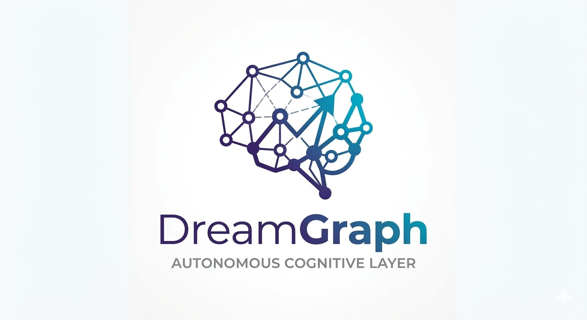

# DreamGraph v8.0.0 — Vishnu


DreamGraph is a graph-first cognitive daemon for MCP-enabled development environments. It combines an instance-scoped daemon, CLI, VS Code extension, dashboard, and a persistent knowledge graph so the graph—not any single file or one-off code read—becomes the system’s source of truth.

It is built for repository understanding, architecture-aware reasoning, disciplined code change, and continuous graph enrichment through scans, workflows, ADR capture, tensions, and dream cycles.

## What DreamGraph Includes

- **Daemon** — the long-running DreamGraph runtime with stdio or HTTP transport
- **MCP tool surface** — tools for graph queries, enrichment, source inspection, cognition, ADRs, workflows, and remediation
- **CLI (`dg`)** — instance creation, attach/detach, start/stop, status, scan, enrich, schedule, export, fork, and migration
- **VS Code extension** — chat, dashboard, changed-files view, daemon connection, and local support tools
- **Knowledge graph + cognitive engine** — features, workflows, data model, tensions, validated relationships, and dream-cycle reasoning

## Why DreamGraph

DreamGraph is designed for development environments where architectural memory matters.

Instead of treating every prompt as stateless, it maintains a structured graph of:
- features
- workflows
- data-model entities
- architecture decisions
- UI registry elements
- tensions and candidate hypotheses

That allows the system to answer from accumulated project understanding, not just a single file read.

## Prerequisites

Before installing or running DreamGraph, make sure you have:

- **Node.js 20+** for the root project build and runtime (`package.json` uses modern TypeScript/Node tooling)
- **npm** for installing dependencies and running builds
- **Git** for cloning and normal repository workflows
- **VS Code 1.100+** if you want the extension experience
- **A supported shell**
  - **Windows:** PowerShell 7+ recommended
  - **Linux/macOS:** Bash-compatible shell
- **Optional: `code` CLI in PATH** if you want the installer to automatically install the VS Code extension
- **Optional: PostgreSQL** for database-backed or production-oriented deployments

Quick checks:

```bash
node --version
npm --version
git --version
code --version
```

## Install From Source

### Windows (PowerShell)

```powershell
git clone https://github.com/mmethodz/dreamgraph.git
cd dreamgraph
./scripts/install.ps1 -Force
```

### Linux / macOS (Bash)

```bash
git clone https://github.com/mmethodz/dreamgraph.git
cd dreamgraph
bash scripts/install.sh --force
```

The installer builds DreamGraph, deploys the `dg` CLI, and installs the VS Code extension when the `code` CLI is available.

For full installation details and troubleshooting, see [INSTALL.md](INSTALL.md).

## Quick Start

### 1. Build from source manually

If you are working directly from the repository:

```bash
npm install
npm run build
```

### 2. Create a DreamGraph instance

Create an instance and optionally attach it to the current repository immediately:

```bash
dg init --name my-project --project /path/to/your/repo --transport http --port 8100
```

What this does:
- creates a named DreamGraph instance
- records the project root
- configures the daemon transport
- prepares the instance for CLI, dashboard, and VS Code attachment

### 3. Start the daemon

#### HTTP daemon mode (background)

Use this when you want a long-running background daemon process:

```bash
dg start my-project --http
```

If the configured port is busy, DreamGraph will select an available HTTP port.

#### Foreground stdio mode

Use this when an MCP client is expected to manage the process directly:

```bash
dg start my-project --foreground
```

This is the actual supported stdio startup path. Background stdio is intentionally rejected by the CLI.

### 4. Check status

```bash
dg status my-project
```

This shows:
- instance identity
- attached project root
- daemon running state
- transport and port
- dream cycle count
- graph/tension/ADR/UI counts

### 5. Attach an existing project later

If you created the instance first and want to bind a repo afterward:

```bash
dg attach /path/to/your/repo --instance my-project
```

### 6. Bootstrap the knowledge graph

Once the daemon is running and the project is attached:

```bash
dg scan my-project
```

You can also use:

```bash
dg enrich my-project
dg curate my-project
```

## Typical Development Flows

### Local development from the repo

```bash
npm install
npm run build
npm test
npm run start
```

### CLI-oriented daemon workflow

```bash
dg init --name my-project --project /path/to/repo --transport http --port 8100
dg start my-project --http
dg status my-project
dg scan my-project
```

### VS Code workflow

1. Install DreamGraph and the VS Code extension
2. Start or connect to a DreamGraph instance
3. Open the attached repository in VS Code
4. Use the DreamGraph sidebar for chat, dashboard, and file-change context

## Core Commands

```bash
npm run build
npm test
node dist/index.js
node dist/cli/dg.js --help
dg --help
dg init --name my-project --project /path/to/repo --transport http --port 8100
dg start my-project --http
dg start my-project --foreground
dg status my-project
dg scan my-project
```

## Architecture at a Glance

DreamGraph has five major surfaces:

- **Knowledge graph** — features, workflows, data model, ADRs, UI registry, tensions, and validated edges
- **Cognitive engine** — dream cycles, normalization, promotion, temporal/causal analysis, remediation planning
- **Daemon runtime** — the MCP-capable service layer exposed through stdio or HTTP
- **CLI** — operational control over instances and daemon lifecycle
- **VS Code extension** — the primary interactive user experience for chat, dashboarding, and local-tool execution

For deeper architectural detail, see:
- [docs/architecture.md](docs/architecture.md)
- [docs/cognitive-engine.md](docs/cognitive-engine.md)
- [docs/tools-reference.md](docs/tools-reference.md)
- [docs/workflows.md](docs/workflows.md)

## Source Layout

```text
src/
  api/
  cli/
  cognitive/
  config/
  data/
  db/
  discipline/
  instance/
  resources/
  server/
  tools/
  utils/

extensions/
  vscode/
    src/
      extension.ts
      chat-panel.ts
      dashboard-view.ts
      daemon-client.ts
      mcp-client.ts
      local-tools.ts
      tool-groups.ts
```

## Version Semantics

DreamGraph instance status can show two different version concepts:

- **Created With** — the DreamGraph version recorded when the instance was initialized
- **Daemon Version** — the version of the currently running daemon/runtime

These can differ after upgrades, and that is expected.

> After installing or updating DreamGraph, restart any running DreamGraph daemon instances and reload VS Code windows so the updated runtime and extension code are actually in use.

## Documentation

- [INSTALL.md](INSTALL.md)
- [docs/README.md](docs/README.md)
- [docs/architecture.md](docs/architecture.md)
- [docs/setup-llm.md](docs/setup-llm.md)
- [docs/tools-reference.md](docs/tools-reference.md)

## License

This repository is licensed under the **DreamGraph Source-Available Community License v2.0**. See [LICENSE](LICENSE) for the full terms.
