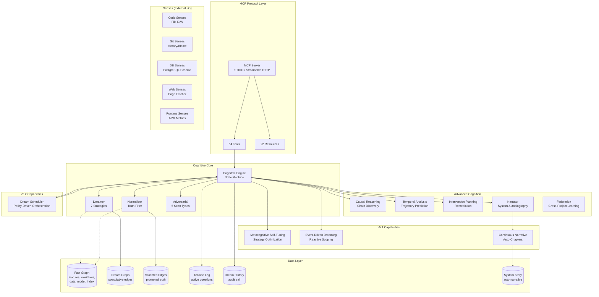
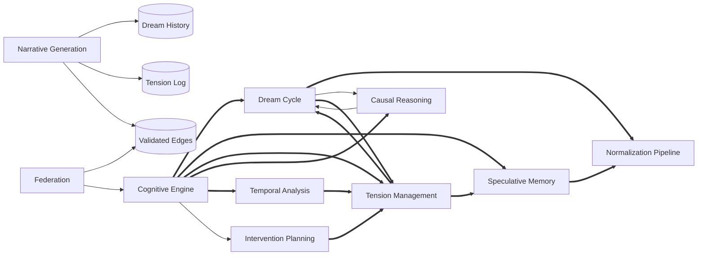

# DreamGraph Architecture

> *Auto-generated from DreamGraph's own knowledge graph on 2026-04-04.*

## Overview

DreamGraph is a **cognitive dreaming engine** for MCP (Model Context Protocol) knowledge graphs. It speculatively discovers hidden connections, validates them against a fact graph, and builds a persistent, evolving understanding of the systems it observes.

**Version:** 6.0.0 "La Catedral"  
**License:** MIT  
**Runtime:** Node.js (TypeScript, ES2022, Node16 modules)  
**Transport:** STDIO (default) or Streamable HTTP (`--transport http`)

## Core Concepts

### The Two Graphs

DreamGraph maintains two parallel knowledge structures:

1. **Fact Graph** (immutable) — The ground truth. Five JSON files describing the target project's features, workflows, data model, and entity index. Never modified by the cognitive system.

2. **Dream Graph** (speculative) — A living memory of hypothetical connections. Dream edges are generated during REM cycles, scored against the fact graph, and either promoted to validated status or decayed away.

### Cognitive States

The engine operates as a strict state machine with four states:

```
AWAKE ──→ REM ──→ NORMALIZING ──→ AWAKE
  │                                  ▲
  └──→ NIGHTMARE ────────────────────┘
```

| State | Purpose | What Happens |
|-------|---------|-------------|
| **AWAKE** | Idle / query-ready | All MCP tools available, reads/writes fact graph |
| **REM** | Speculative generation | Dreamer generates hypothetical edges using 7 strategies |
| **NORMALIZING** | Validation | Three-outcome classifier: validate, retain, or reject |
| **NIGHTMARE** | Adversarial scanning | Five security strategies probe for vulnerabilities |

### The Promotion Pipeline

```
Speculative Edge → Normalization → Promotion Gate → Validated Edge
                      │                                    │
                      ├─ Latent (retained)                 │
                      └─ Rejected (discarded)              └─ Knowledge Graph
```

**Promotion Gate Thresholds:**
- Combined confidence ≥ 0.62
- Plausibility ≥ 0.45
- Evidence ≥ 0.40
- Evidence count ≥ 2
- Contradiction ≤ 0.3

## System Architecture Diagram



## Feature Dependencies

The cognitive engine sits at the center, orchestrating all other features:



## Source Layout

```
src/
├── index.ts                 # Entry point — CLI arg parser + transport launcher
├── server/
│   └── server.ts            # McpServer factory
├── config/
│   └── config.ts            # Central configuration + env var parsing
├── cognitive/
│   ├── engine.ts            # State machine, tension management, persistence
│   ├── dreamer.ts           # REM generation — 7 dream strategies
│   ├── normalizer.ts        # Three-outcome classifier (Truth Filter)
│   ├── adversarial.ts       # NIGHTMARE state — 5 security scan strategies
│   ├── causal.ts            # Causal chain discovery via BFS
│   ├── temporal.ts          # Time-dimension analysis — trajectory, prediction
│   ├── intervention.ts      # Remediation plan generation
│   ├── narrator.ts          # System autobiography + continuous narrative (v5.1)
│   ├── federation.ts        # Cross-project archetype exchange
│   ├── metacognition.ts     # Metacognitive self-tuning (v5.1)
│   ├── event-router.ts      # Event-driven dreaming (v5.1)
│   ├── scheduler.ts         # Dream Scheduler — instance-aware orchestration (v5.2→v6.0)
│   ├── types.ts             # All cognitive type definitions
│   └── register.ts          # Tool/resource registration + post-cycle hooks
├── discipline/              # Self-imposed execution governance (v6.0 La Catedral)
│   ├── types.ts             # Phase, tool class, protection, session types
│   ├── state-machine.ts     # Five-phase state machine with transition rules
│   ├── protection.ts        # Three-tier data file protection
│   ├── manifest.ts          # 53-tool classification + phase permissions
│   ├── register.ts          # discipline://manifest resource + tool registration + barrel exports
│   ├── session.ts           # Task session lifecycle + disk persistence
│   ├── prompts.ts           # Phase-specific system prompt templates
│   ├── tool-proxy.ts        # Runtime tool permission checking + phase filtering
│   ├── artifacts.ts         # Delta table, plan, verification report generators
│   └── tools.ts             # 9 discipline MCP tools
├── instance/                # UUID-scoped instance architecture (v6.0 La Catedral)
│   ├── types.ts             # Instance identity, registry, policy, config types
│   ├── scope.ts             # InstanceScope — file-system isolation enforcement
│   ├── registry.ts          # Master registry CRUD (~/.dreamgraph/instances.json)
│   ├── lifecycle.ts         # Create, load, resolve, migrate instances
│   ├── policies.ts          # policies.json parser, validator, runtime queries
│   └── index.ts             # Barrel re-exports
├── cli/                     # CLI instance manager — `dg` binary (v6.0 La Catedral)
│   ├── dg.ts                # Entry point — arg tokenizer + command router
│   ├── utils/
│   │   └── daemon.ts        # Shared daemon utilities (PID, ports, health, locks, logs)
│   └── commands/
│       ├── init.ts          # dg init — create new instance
│       ├── attach.ts        # dg attach / dg detach — project binding
│       ├── instances.ts     # dg instances list / switch
│       ├── status.ts        # dg status — cognitive state overview + daemon info
│       ├── lifecycle-ops.ts # dg archive / dg destroy
│       ├── export.ts        # dg export — snapshot / docs / archetypes
│       ├── fork.ts          # dg fork — copy instance with new UUID
│       ├── migrate.ts       # dg migrate — legacy data/ → UUID instance
│       ├── start.ts         # dg start — spawn HTTP daemon or foreground server
│       ├── stop.ts          # dg stop — graceful/forced shutdown
│       └── restart.ts       # dg restart — atomic stop → start
├── tools/
│   ├── register.ts          # General tool registration
│   ├── code-senses.ts       # File system read/write/list
│   ├── git-senses.ts        # Git log/blame
│   ├── db-senses.ts         # PostgreSQL schema inspector (lazy pg import)
│   ├── web-senses.ts        # Web page fetcher
│   ├── runtime-senses.ts    # APM metrics integration
│   ├── solidify-insight.ts  # Manual insight injection
│   ├── enrich-seed-data.ts  # Seed data enrichment (merge/replace)
│   ├── init-graph.ts        # Bootstrap knowledge graph from source
│   ├── visual-architect.ts  # Mermaid diagram generation
│   ├── adr-historian.ts     # Architecture Decision Records
│   ├── ui-registry.ts       # Semantic UI element registry
│   ├── living-docs-exporter.ts  # Markdown documentation export
│   ├── get-workflow.ts      # Workflow query tool
│   ├── search-data-model.ts # Data model search tool
│   └── query-resource.ts    # Generic URI-based query
├── resources/
│   └── register.ts          # 6 system:// MCP resources
├── types/
│   └── index.ts             # Re-exports
└── utils/
    ├── cache.ts             # In-memory JSON cache + pluggable dataDir resolver
    ├── errors.ts            # Error handling + response factories
    ├── logger.ts            # Stderr logger (protects STDIO stream)
    ├── mutex.ts             # Async file mutex with instance-aware key resolver
    └── paths.ts             # Lazy dataPath() utility for instance-aware paths
scripts/
├── install.ps1              # Windows PowerShell global installer
├── install.sh               # Linux/macOS Bash global installer
└── enrich-graph.mjs         # Seed graph enrichment helper
templates/
└── default/                 # Instance initialization seed data
    ├── config/
    │   └── policies.json    # Default discipline policies (strict/balanced/creative)
    └── *.json               # 19 empty data stubs for new instances
tests/
└── instance-isolation.test.ts  # Instance boundary + policy validation tests (vitest)
```

## Data Directory

```
data/                                    # Legacy mode (flat) or <instance>/data/ (UUID mode)
├── system_overview.json     # Project description
├── features.json            # Feature entities + cross-links
├── workflows.json           # Operational workflows
├── data_model.json          # Data entity definitions
├── index.json               # Entity ID → URI lookup
├── capabilities.json        # MCP capability declarations
├── dream_graph.json         # Active speculative edges
├── candidate_edges.json     # Normalization audit log
├── validated_edges.json     # Promoted edges (fact-adjacent)
├── tension_log.json         # Active + resolved tensions
├── dream_history.json       # Full cycle audit trail
├── adr_log.json             # Architecture Decision Records
├── ui_registry.json         # Semantic UI elements
├── threat_log.json          # Adversarial scan results (NIGHTMARE)
├── dream_archetypes.json    # Federated dream archetypes
├── meta_log.json            # Metacognitive analysis audit trail
├── event_log.json           # Cognitive event dispatch log
├── system_story.json        # Auto-generated narrative (v5.1)
└── schedules.json           # Dream Scheduler persistence (v5.2)
```

## Configuration

| Env Variable | Default | Description |
|-------------|---------|-------------|
| `DREAMGRAPH_DATA_DIR` | `./data` | Path to data directory (legacy mode) |
| `DREAMGRAPH_INSTANCE_UUID` | — | UUID of the instance to load (enables UUID mode) |
| `DREAMGRAPH_MASTER_DIR` | `~/.dreamgraph` | Master directory for all instances |
| `DREAMGRAPH_DEBUG` | `false` | Enable debug logging to stderr |
| `DREAMGRAPH_FEDERATION` | `false` | Enable cross-project federation |
| `DREAMGRAPH_EVENTS` | `true` | Enable event-driven dreaming (v5.1) |
| `DREAMGRAPH_NARRATIVE` | `true` | Enable continuous narrative (v5.1) |
| `DATABASE_URL` | — | PostgreSQL connection string for DB senses |
| `DREAMGRAPH_RUNTIME_ENDPOINT` | — | APM metrics endpoint URL |
| `DREAMGRAPH_RUNTIME_TYPE` | — | Metrics format: `otlp`, `prometheus`, or `custom` |
| `DREAMGRAPH_REPOS` | `{}` | JSON object mapping repo names to local paths. In instance mode, repos from `mcp.json` are merged automatically and `project_root` is auto-registered as a fallback — this env var becomes optional. |
| `DREAMGRAPH_SCHEDULER` | `{"enabled":true}` | JSON config for dream scheduler (v5.2): `enabled`, `tick_interval_ms`, `max_runs_per_hour`, `cooldown_ms`, `nightmare_cooldown_ms`, `error_streak_pause_limit` |
