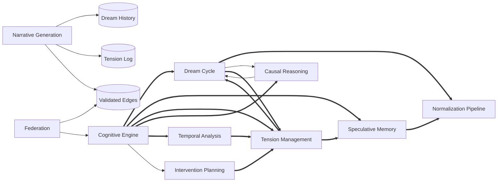

# DreamGraph Architecture

> *Auto-generated from DreamGraph's own knowledge graph on 2026-04-04.*

## Overview

DreamGraph is a **cognitive dreaming engine** for MCP (Model Context Protocol) knowledge graphs. It speculatively discovers hidden connections, validates them against a fact graph, and builds a persistent, evolving understanding of the systems it observes.

**Version:** 5.1.0  
**License:** MIT  
**Runtime:** Node.js (TypeScript, ES2022, Node16 modules)  
**Transport:** STDIO (JSON-RPC via stdin/stdout)

## Core Concepts

### The Two Graphs

DreamGraph maintains two parallel knowledge structures:

1. **Fact Graph** (immutable) — The ground truth. Five JSON files describing the target project's features, workflows, data model, and entity index. Never modified by the cognitive system.

2. **Dream Graph** (speculative) — A living memory of hypothetical connections. Dream edges are generated during REM cycles, scored against the fact graph, and either promoted to validated status or decayed away.

### Cognitive States

The engine operates as a strict state machine with four states:

```
AWAKE ──→ REM ──→ NORMALIZING ──→ AWAKE
  │                                  ▲
  └──→ NIGHTMARE ────────────────────┘
```

| State | Purpose | What Happens |
|-------|---------|-------------|
| **AWAKE** | Idle / query-ready | All MCP tools available, reads/writes fact graph |
| **REM** | Speculative generation | Dreamer generates hypothetical edges using 7 strategies |
| **NORMALIZING** | Validation | Three-outcome classifier: validate, retain, or reject |
| **NIGHTMARE** | Adversarial scanning | Five security strategies probe for vulnerabilities |

### The Promotion Pipeline

```
Speculative Edge → Normalization → Promotion Gate → Validated Edge
                      │                                    │
                      ├─ Latent (retained)                 │
                      └─ Rejected (discarded)              └─ Knowledge Graph
```

**Promotion Gate Thresholds:**
- Combined confidence ≥ 0.62
- Plausibility ≥ 0.45
- Evidence ≥ 0.40
- Evidence count ≥ 2
- Contradiction ≤ 0.3

## System Architecture Diagram

```mermaid
graph TB
    subgraph "MCP Protocol Layer"
        Server["MCP Server<br/>STDIO Transport"]
        Tools["37 Tools"]
        Resources["13 Resources"]
    end

    subgraph "Cognitive Core"
        Engine["Cognitive Engine<br/>State Machine"]
        Dreamer["Dreamer<br/>7 Strategies"]
        Normalizer["Normalizer<br/>Truth Filter"]
        Adversarial["Adversarial<br/>5 Scan Types"]
    end

    subgraph "Advanced Cognition"
        Causal["Causal Reasoning<br/>Chain Discovery"]
        Temporal["Temporal Analysis<br/>Trajectory Prediction"]
        Intervention["Intervention Planning<br/>Remediation"]
        Narrator["Narrator<br/>System Autobiography"]
        Federation["Federation<br/>Cross-Project Learning"]
    end

    subgraph "v5.1 Capabilities"
        Metacognition["Metacognitive Self-Tuning<br/>Strategy Optimization"]
        EventRouter["Event-Driven Dreaming<br/>Reactive Scoping"]
        ContinuousNarrative["Continuous Narrative<br/>Auto-Chapters"]
    end

    subgraph "Senses (External I/O)"
        Code["Code Senses<br/>File R/W"]
        Git["Git Senses<br/>History/Blame"]
        DB["DB Senses<br/>PostgreSQL Schema"]
        Web["Web Senses<br/>Page Fetcher"]
        Runtime["Runtime Senses<br/>APM Metrics"]
    end

    subgraph "Data Layer"
        FactGraph[("Fact Graph<br/>features, workflows,<br/>data_model, index")]
        DreamGraph[("Dream Graph<br/>speculative edges")]
        Validated[("Validated Edges<br/>promoted truth")]
        Tensions[("Tension Log<br/>active questions")]
        History[("Dream History<br/>audit trail")]
        Story[("System Story<br/>auto-narrative")]
    end

    Server --> Tools
    Server --> Resources
    Tools --> Engine
    Engine --> Dreamer
    Engine --> Normalizer
    Engine --> Adversarial
    Engine --> Causal
    Engine --> Temporal
    Engine --> Intervention
    Engine --> Narrator
    Engine --> Metacognition
    Engine --> EventRouter
    Narrator --> ContinuousNarrative
    Dreamer --> DreamGraph
    Normalizer --> Validated
    Engine --> Tensions
    Engine --> History
    ContinuousNarrative --> Story
    Dreamer -.-> FactGraph
    Normalizer -.-> FactGraph
```



## Feature Dependencies

The cognitive engine sits at the center, orchestrating all other features:



## Source Layout

```
src/
├── index.ts                 # Entry point — creates STDIO transport
├── server/
│   └── server.ts            # McpServer factory
├── config/
│   └── config.ts            # Central configuration + env var parsing
├── cognitive/
│   ├── engine.ts            # State machine, tension management, persistence
│   ├── dreamer.ts           # REM generation — 7 dream strategies
│   ├── normalizer.ts        # Three-outcome classifier (Truth Filter)
│   ├── adversarial.ts       # NIGHTMARE state — 5 security scan strategies
│   ├── causal.ts            # Causal chain discovery via BFS
│   ├── temporal.ts          # Time-dimension analysis — trajectory, prediction
│   ├── intervention.ts      # Remediation plan generation
│   ├── narrator.ts          # System autobiography + continuous narrative (v5.1)
│   ├── federation.ts        # Cross-project archetype exchange
│   ├── metacognition.ts     # Metacognitive self-tuning (v5.1)
│   ├── event-router.ts      # Event-driven dreaming (v5.1)
│   ├── types.ts             # All cognitive type definitions
│   └── register.ts          # Tool/resource registration + post-cycle hooks
├── tools/
│   ├── register.ts          # General tool registration
│   ├── code-senses.ts       # File system read/write/list
│   ├── git-senses.ts        # Git log/blame
│   ├── db-senses.ts         # PostgreSQL schema inspector
│   ├── web-senses.ts        # Web page fetcher
│   ├── runtime-senses.ts    # APM metrics integration
│   ├── solidify-insight.ts  # Manual insight injection
│   ├── visual-architect.ts  # Mermaid diagram generation
│   ├── adr-historian.ts     # Architecture Decision Records
│   ├── ui-registry.ts       # Semantic UI element registry
│   ├── living-docs-exporter.ts  # Markdown documentation export
│   ├── get-workflow.ts      # Workflow query tool
│   ├── search-data-model.ts # Data model search tool
│   └── query-resource.ts    # Generic URI-based query
├── resources/
│   └── register.ts          # MCP resource registration
├── types/
│   └── index.ts             # Re-exports
└── utils/
    ├── cache.ts             # In-memory JSON cache
    ├── errors.ts            # Error handling + response factories
    └── logger.ts            # Stderr logger (protects STDIO)
```

## Data Directory

```
data/
├── system_overview.json     # Project description
├── features.json            # Feature entities + cross-links
├── workflows.json           # Operational workflows
├── data_model.json          # Data entity definitions
├── index.json               # Entity ID → URI lookup
├── capabilities.json        # MCP capability declarations
├── dream_graph.json         # Active speculative edges
├── candidate_edges.json     # Normalization audit log
├── validated_edges.json     # Promoted edges (fact-adjacent)
├── tension_log.json         # Active + resolved tensions
├── dream_history.json       # Full cycle audit trail
├── adr_log.json             # Architecture Decision Records
├── ui_registry.json         # Semantic UI elements
└── system_story.json        # Auto-generated narrative (v5.1)
```

## Configuration

| Env Variable | Default | Description |
|-------------|---------|-------------|
| `DREAMGRAPH_DATA_DIR` | `./data` | Path to data directory |
| `DREAMGRAPH_DEBUG` | `false` | Enable debug logging to stderr |
| `DREAMGRAPH_FEDERATION` | `false` | Enable cross-project federation |
| `DREAMGRAPH_EVENTS` | `true` | Enable event-driven dreaming (v5.1) |
| `DREAMGRAPH_NARRATIVE` | `true` | Enable continuous narrative (v5.1) |
| `DATABASE_URL` | — | PostgreSQL connection string for DB senses |
| `DREAMGRAPH_RUNTIME_ENDPOINT` | — | APM metrics endpoint URL |
| `DREAMGRAPH_RUNTIME_TYPE` | — | Metrics format: `otlp`, `prometheus`, or `custom` |
