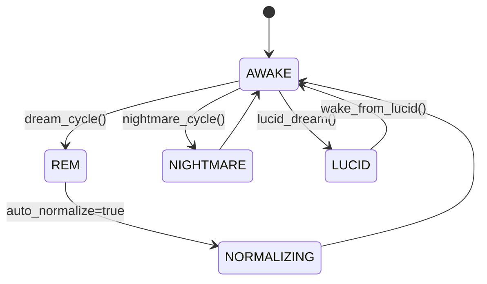

# DreamGraph v5.0 Cognitive Engine

> *"The graph dreams, forgets, and learns."*

The Cognitive Engine is the heart of DreamGraph's autonomous learning system. It operates as a stateful cognitive loop that continuously analyzes the knowledge graph, generates hypotheses, validates them, and maintains architectural memory over time.

---

## Core Principles

### 1. Speculation is isolated from fact
Dreams (hypotheses) are generated in a separate dream graph and must pass the **Truth Filter** before promotion to the validated fact graph. Speculation never mutates truth directly.

### 2. Memory decays unless reinforced
Unvalidated ideas fade over time. Reinforced or validated insights become persistent architectural memory.

### 3. Tensions surface unresolved risk
The engine continuously tracks tensions — contradictions, weak assumptions, risky patterns, and architectural drift.

### 4. Cycles create convergence
Repeated dream → normalize → validate loops improve graph accuracy and system understanding.

---

## Cognitive State Machine

DreamGraph operates as a five-state machine:



### States

| State | Purpose |
|---|---|
| **AWAKE** | Normal operating mode. Fact graph is stable and queryable. |
| **REM** | Speculative dream generation. Hypotheses are created but not yet trusted. |
| **NORMALIZING** | Truth Filter evaluates dream candidates and promotes / rejects / retains as latent. |
| **NIGHTMARE** | Adversarial scan mode for threats, vulnerabilities, and anti-patterns. |
| **LUCID** | Interactive human-guided hypothesis exploration. |

---

## Dream Pipeline

### 1. Dream generation
The engine analyzes graph structure, source signals, and optionally LLM output to produce candidate edges, tensions, or missing abstractions.

### 2. Normalization
Dream candidates are scored using structural evidence, recurrence, signal quality, and confidence. Outcomes:

- **validated** → promoted to fact graph
- **latent** → kept as speculative memory
- **rejected** → discarded

### 3. Decay
Unreinforced dreams and stale tensions decay or expire over time.

### 4. Promotion and memory
Validated edges become part of long-term architectural understanding and can influence future reasoning, documentation, and remediation planning.

---

## Dream Strategies

DreamGraph supports multiple dream-generation strategies.

| Strategy | Purpose |
|---|---|
| `llm_dream` | LLM-generated high-level architectural hypotheses |
| `gap_detection` | Finds related entities that should likely be connected |
| `weak_reinforcement` | Strengthens weak but recurring signals |
| `cross_domain` | Bridges disconnected domains |
| `missing_abstraction` | Proposes unifying abstractions or higher-level concepts |
| `symmetry_completion` | Adds likely reverse / mirrored relationships |
| `tension_directed` | Focuses dreaming around unresolved tensions |
| `causal_replay` | Mines historical cause → effect chains |
| `reflective` | Agent-driven insight capture after code reading |
| `all` | Runs the full strategy set |

---

## Truth Filter

The Truth Filter decides what becomes fact.

### Inputs to scoring

- dream confidence
- reinforcement count
- recurrence across cycles
- graph topology support
- cross-signal evidence
- contradiction pressure

### Typical outcomes

| Outcome | Meaning |
|---|---|
| **validated** | Strong enough to promote into fact graph |
| **latent** | Plausible but not yet proven |
| **rejected** | Too weak, contradictory, or low-value |
| **expired** | Decayed after insufficient reinforcement |

The promotion threshold is configurable in the cognitive engine policy profile.

---

## Tensions

Tensions are durable records of unresolved architectural issues.

Examples:

- a workflow that spans features with unclear ownership
- duplicated logic across modules
- likely missing abstraction
- inconsistent validation behavior
- threat or compliance concerns

Tensions can be:
- created by dream cycles
- created by reflective code reading
- resolved by humans or the system
- revisited if contradictory evidence reappears

---

## Normalizer and Dreamer Separation

The cognitive engine supports separate LLM tuning for:

- **Dreamer** — creative hypothesis generation
- **Normalizer** — lower-temperature validation and truth filtering

This separation is useful because:
- dream generation benefits from broader creativity
- normalization benefits from stricter consistency and lower variance

---

## Configuration

LLM settings are configured via environment variables or per-instance `config/engine.env` files:

| Variable | Default | Description |
|----------|---------|-------------|
| `DREAMGRAPH_LLM_PROVIDER` | `ollama` | Provider type: `ollama`, `openai`, `anthropic`, `sampling`, `none` |
| `DREAMGRAPH_LLM_MODEL` | `qwen3:8b` | Base model name used unless Dreamer/Normalizer overrides are set |
| `DREAMGRAPH_LLM_URL` | `http://localhost:11434` | API base URL |
| `DREAMGRAPH_LLM_API_KEY` | — | API key (required for `openai` and `anthropic` providers) |
| `DREAMGRAPH_LLM_TEMPERATURE` | `0.7` | Base creativity parameter (0.0–1.0) |
| `DREAMGRAPH_LLM_MAX_TOKENS` | `2048` | Base max response tokens |
| `DREAMGRAPH_LLM_DREAMER_MODEL` | *(base model)* | Override model for Dreamer component |
| `DREAMGRAPH_LLM_DREAMER_TEMPERATURE` | *(base temp)* | Override temperature for Dreamer |
| `DREAMGRAPH_LLM_DREAMER_MAX_TOKENS` | *(base tokens)* | Override max tokens for Dreamer |
| `DREAMGRAPH_LLM_NORMALIZER_MODEL` | *(base model)* | Override model for Normalizer component |
| `DREAMGRAPH_LLM_NORMALIZER_TEMPERATURE` | `0.1` if unset | Override temperature for Normalizer |
| `DREAMGRAPH_LLM_NORMALIZER_MAX_TOKENS` | *(base tokens)* | Override max tokens for Normalizer |

### Per-Instance Configuration

Each instance can override the global LLM settings via a `config/engine.env` file. `dg init --template <name>` seeds this file from the selected template using this resolution order: `~/.dreamgraph/templates/<name>/config/engine.env` → repository `templates/<name>/config/engine.env` → in-code scaffold. Users can create additional named templates by copying `~/.dreamgraph/templates/default/` and renaming it, then selecting them with `dg init --template <name>`:

```text
~/.dreamgraph/<instance-uuid>/
└── config/
    ├── instance.json     # Identity
    ├── mcp.json          # Repos, transport
    ├── policies.json     # Discipline rules
    ├── schema_version.json
    └── engine.env        # LLM provider, API keys, dreamer/normalizer settings
```

Example `engine.env`:

```bash
DREAMGRAPH_LLM_PROVIDER=openai
DREAMGRAPH_LLM_URL=https://api.openai.com/v1
DREAMGRAPH_LLM_API_KEY=****
DREAMGRAPH_LLM_DREAMER_MODEL=gpt-4o-mini
DREAMGRAPH_LLM_DREAMER_TEMPERATURE=0.9
DREAMGRAPH_LLM_DREAMER_MAX_TOKENS=10240
DREAMGRAPH_LLM_NORMALIZER_MODEL=gpt-5.4-nano
DREAMGRAPH_LLM_NORMALIZER_TEMPERATURE=0.1
DREAMGRAPH_LLM_NORMALIZER_MAX_TOKENS=4096
```

The `engine.env` file uses simple `KEY=VALUE` syntax (supports comments with `#`, quoted values). Values are loaded at startup **before** config parsing, so they override global env vars with "per-instance wins" semantics. This allows different instances to use different models, providers, or API keys.

### Integration with the Dreamer

When `strategy="all"` is used (the default for scheduled dream cycles):

1. **LLM dream runs first** — allocated 40% of the total dream budget
2. **Structural strategies split the remaining 60%** — gap detection, weak reinforcement, etc.
3. **Normalization runs next** — validates or retains latent signals
4. **Tensions and narratives update** — the graph's memory evolves

---

## Nightmare Mode

`nightmare_cycle()` performs adversarial analysis against the fact graph.

Threat strategies include:

- privilege escalation
- data leak path
- injection surface
- missing validation
- broken access control

Nightmare findings are stored separately from validated facts and can be used to generate remediation plans.

---

## Lucid Dreaming

Lucid dreaming allows an operator to explore a hypothesis interactively.

Flow:

1. start a lucid session with a hypothesis
2. inspect supporting and contradicting signals
3. dig deeper, refine, dismiss, or accept signals
4. wake from lucid to persist accepted outcomes

This provides a human-in-the-loop path from speculation to institutional memory.

---

## Temporal and Causal Cognition

The engine can analyze its own history to infer:

- which tensions are rising or falling
- where changes propagate causally
- which areas repeatedly regress
- where future risk is likely to emerge

These analyses strengthen remediation planning and operational prioritization.

---

## Safety and Guard Rails

Key safety properties:

- REM does not write facts directly
- NIGHTMARE findings are isolated from the fact graph
- tension counts are capped
- stale speculative memory decays automatically
- normalization is threshold-gated
- discipline phases restrict sensitive tool usage

---

## Why this matters

The cognitive engine gives DreamGraph persistence of architectural understanding.

Instead of every session starting from zero, the system:

- remembers validated relationships
- forgets weak or stale speculation
- surfaces risk as tensions
- improves through repeated cycles
- keeps reasoning grounded in a durable graph rather than transient prompts
