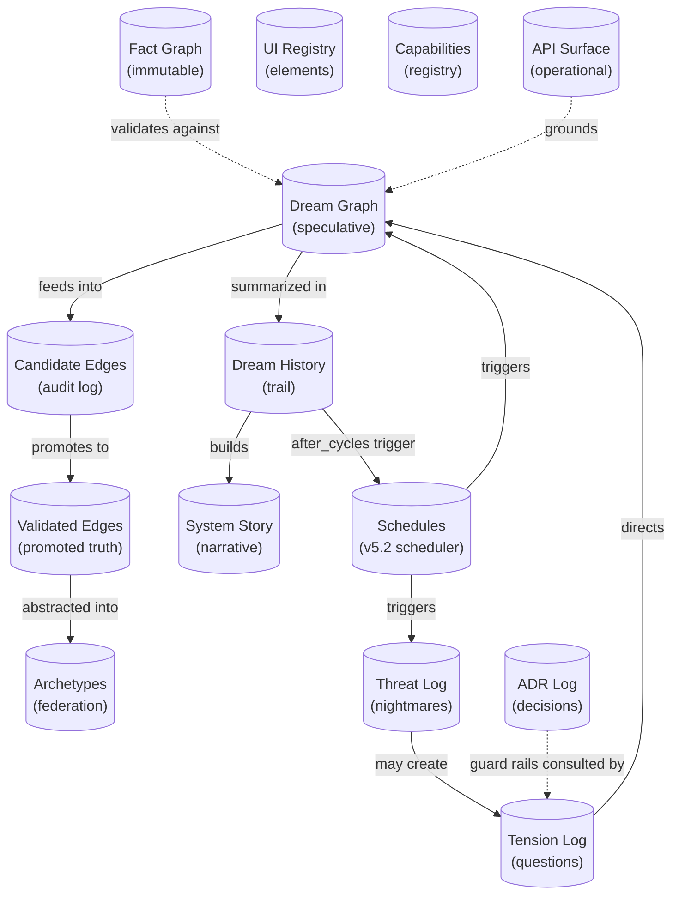

# DreamGraph Data Model

> All 14 data stores that make up DreamGraph's persistent state.

---

## Store Relationship Map

---

## Cognitive Stores

### Dream Graph (`dream_graph.json`)

The primary speculative memory store. Contains hypothetical nodes and edges generated during REM cycles.

**Behavior:** Grows during REM, shrinks during normalization and decay. Deduplication via normalized keys (sorted `from|to` + base relation).

| Field | Type | Description |
|-------|------|-------------|
| `nodes[]` | DreamNode[] | Hypothetical entity representations |
| `nodes[].id` | string | Entity name |
| `nodes[].hypothetical` | boolean | Always `true` |
| `nodes[].domain` | string | Inferred domain |
| `nodes[].confidence` | number | 0.0–1.0, decays each cycle |
| `nodes[].ttl` | number | Cycles until expiry (default 8) |
| `edges[]` | DreamEdge[] | Speculative relationships |
| `edges[].from` | string | Source entity ID |
| `edges[].to` | string | Target entity ID |
| `edges[].relation` | string | Relationship type (e.g. `may_depend_on`) |
| `edges[].confidence` | number | Combined score, decays by 0.05/cycle |
| `edges[].plausibility` | number | Domain coherence score |
| `edges[].evidence` | number | Grounding evidence score |
| `edges[].evidence_count` | number | Independent evidence sources |
| `edges[].contradiction` | number | Conflict score (max 0.3 for promotion) |
| `edges[].strategy` | string | Origin strategy |
| `edges[].ttl` | number | Cycles until expiry |
| `edges[].reinforcement_count` | number | Times re-generated (dedup counter) |
| `edges[].generated_at` | number | Cycle when first created |
| `edges[].status` | string | `candidate` \| `latent` \| `validated` \| `rejected` |

**Relationships:** Feeds into `candidate_edges_store`, promotes to `validated_edges_store`, validated against `fact_graph`.

---

### Candidate Edges (`candidate_edges.json`)

Append-only log of all normalization judgments. Never truncated — grows monotonically.

| Field | Type | Description |
|-------|------|-------------|
| `id` | string | Unique identifier |
| `from` | string | Source entity |
| `to` | string | Target entity |
| `relation` | string | Relationship type |
| `outcome` | string | `validated` \| `latent` \| `rejected` |
| `scores` | object | Full breakdown: plausibility, evidence, contradiction, confidence |
| `cycle` | number | Normalization cycle number |

---

### Validated Edges (`validated_edges.json`)

Edges that passed the promotion gate. Generally stable and growing.

**Promotion criteria:** confidence ≥ 0.62, plausibility ≥ 0.45, evidence ≥ 0.40, evidence_count ≥ 2, contradiction ≤ 0.3.

| Field | Type | Description |
|-------|------|-------------|
| `from` | string | Source entity |
| `to` | string | Target entity |
| `relation` | string | Cleaned relationship (no speculative qualifiers) |
| `confidence` | number | Combined confidence at promotion time |
| `promoted_at` | number | Cycle number |
| `strategy` | string | Original dream strategy |

---

### Tension Log (`tension_log.json`)

All tensions: unresolved questions, inconsistencies, discovered gaps. Active cap of **50** prevents cognitive overload. Resolved tensions are archived, not deleted.

| Field | Type | Description |
|-------|------|-------------|
| `id` | string | UUID |
| `description` | string | Human-readable description |
| `type` | string | `missing_link` \| `weak_connection` \| `hard_query` \| `ungrounded_dream` \| `code_insight` |
| `urgency` | number | 0.0–1.0, decays by 0.02/cycle |
| `domain` | string | One of 11 domains: security, invoicing, sync, integration, data_model, auth, payroll, reporting, api, mobile, general |
| `entities` | string[] | Related entity IDs |
| `ttl` | number | Cycles until auto-expiry (default 30) |
| `created_at` | number | Cycle when recorded |
| `resolved` | boolean | Whether closed |
| `resolution.type` | string | `confirmed_fixed` \| `false_positive` \| `wont_fix` |
| `resolution.authority` | string | `human` \| `system` |
| `resolution.cycle` | number | When resolved |

---

### Dream History (`dream_history.json`)

Append-only audit trail of every cycle. Never modified, only appended.

| Field | Type | Description |
|-------|------|-------------|
| `cycle` | number | Monotonically increasing |
| `phase` | string | `dream` \| `nightmare` |
| `dreams` | number | Edges generated |
| `promoted` | number | Edges promoted |
| `latent` | number | Edges kept as speculative memory |
| `rejected` | number | Edges discarded |
| `expired` | number | Edges decayed away |
| `strategies` | object | Strategy → count map |
| `tensions_active` | number | Active tension count at cycle end |
| `timestamp` | string | ISO timestamp |

---

### Threat Log (`threat_log.json`)

Output from NIGHTMARE adversarial scans.

| Field | Type | Description |
|-------|------|-------------|
| `from` | string | Attack surface / vulnerable component |
| `to` | string | Affected resource / data |
| `threat_type` | string | `privilege_escalation` \| `data_leak_path` \| `injection_surface` \| `missing_validation` \| `broken_access_control` |
| `severity` | string | `critical` \| `high` \| `medium` \| `low` |
| `cwe_id` | string | CWE identifier (e.g. CWE-269) |
| `description` | string | Threat description |
| `blast_radius` | string[] | Potentially affected entities |
| `cycle` | number | Discovery cycle |

---

### Archetypes (`dream_archetypes.json`)

Anonymized patterns for cross-project federation.

| Field | Type | Description |
|-------|------|-------------|
| `id` | string | Unique archetype ID |
| `pattern_type` | string | `security_pattern` \| `structural_gap` \| `cross_domain_bridge` \| `tension_resolution` \| `symmetry_pattern` \| `reinforcement_pattern` \| `causal_pattern` \| `generic_connection` |
| `from_role` | string | Anonymized source role (e.g. `auth_component`) |
| `to_role` | string | Anonymized target role |
| `relation` | string | Abstracted relationship |
| `confidence` | number | Confidence at extraction time |
| `source_system` | string | Anonymized origin identifier |

---

## Documentation Stores

### ADR Log (`adr_log.json`)

Append-only Architecture Decision Records.

| Field | Type | Description |
|-------|------|-------------|
| `id` | number | Sequential ADR number |
| `title` | string | Decision title |
| `status` | string | `accepted` \| `deprecated` \| `superseded` |
| `context` | string | Problem statement |
| `decision` | string | What was decided |
| `alternatives` | string[] | Considered alternatives |
| `consequences` | string[] | Known consequences |
| `guard_rails` | string[] | Constraints that must be preserved |
| `entities` | string[] | Related entity IDs |
| `tags` | string[] | Classification tags |
| `date` | string | ISO date |

---

### UI Registry (`ui_registry.json`)

Semantic UI element definitions across platforms. Supports merge-on-update and platform gap detection.

| Field | Type | Description |
|-------|------|-------------|
| `id` | string | Unique element ID (kebab-case) |
| `name` | string | Display name |
| `category` | string | `data_display` \| `data_input` \| `navigation` \| `feedback` \| `layout` \| `action` \| `composite` |
| `purpose` | string | Semantic purpose |
| `features` | string[] | Related feature IDs |
| `data_contract` | object | Input/output/events specification |
| `interaction_model` | string[] | `hover` \| `click` \| `drag` \| `keyboard` \| `touch` \| `swipe` |
| `platforms` | object | `{ web: {...}, ios: {...}, android: {...} }` |

---

## Foundation Stores

### Fact Graph (`data/*.json`)

The immutable knowledge base — **never modified by the cognitive system**. Written only by the enrichment script or manual population.

| File | Content |
|------|---------|
| `system_overview.json` | Project description, architecture overview |
| `features.json` | Feature entities with cross-links (GraphLink[]) |
| `workflows.json` | Operational workflows with steps, triggers, actors |
| `data_model.json` | Data entity definitions with key fields, relationships |
| `index.json` | Entity ID → resource URI lookup |

### Capabilities Registry (`capabilities.json`)

MCP capability declarations — all tools and resources with schemas.

| Field | Type | Description |
|-------|------|-------------|
| `tools` | Tool[] | MCP tool declarations |
| `resources` | Resource[] | MCP resource declarations |

---

## v5.1: System Story (`system_story.json`)

Persistent, auto-accumulated narrative. Survives restarts.

| Field | Type | Description |
|-------|------|-------------|
| `chapters[]` | Chapter[] | Auto-generated every 10 cycles |
| `chapters[].title` | string | Chapter title |
| `chapters[].cycle_range` | [number, number] | Cycles covered |
| `chapters[].body` | string | Narrative text |
| `chapters[].stats` | object | Validated, rejected, tensions |
| `weekly_digests[]` | Digest[] | Aggregate summaries |
| `weekly_digests[].health_trend` | string | Overall trend analysis |

---

## v5.2: Schedules (`schedules.json`)

Persistent store for the Dream Scheduler. All active and completed schedules with full execution history. Survives restarts — active schedules resume automatically on startup.

### Schedule Object

| Field | Type | Description |
|-------|------|-------------|
| `id` | string | Unique ID (e.g. `sched_1775322785274_jcs3zm`) |
| `label` | string | Human-readable name |
| `action` | string | `dream_cycle` \| `nightmare_cycle` \| `normalize_dreams` \| `metacognitive_analysis` \| `get_causal_insights` \| `get_temporal_insights` \| `export_dream_archetypes` |
| `trigger_type` | string | `interval` \| `cron_like` \| `after_cycles` \| `on_idle` |
| `trigger_config` | object | Trigger-specific parameters (see below) |
| `action_params` | object | `{ strategy?, max_dreams? }` |
| `enabled` | boolean | Whether the schedule is active |
| `status` | string | `active` \| `paused` \| `completed` \| `error` |
| `max_runs` | number \| null | Total executions before auto-disable (null = unlimited) |
| `run_count` | number | Executions completed so far |
| `error_streak` | number | Consecutive failures (auto-pauses at 3) |
| `last_run_at` | string \| null | ISO timestamp of last execution |
| `next_run_at` | string \| null | Projected next execution time |
| `created_at` | string | ISO timestamp |

### Trigger Config Variants

| Trigger Type | Config Fields |
|-------------|--------------|
| `interval` | `{ interval_seconds: number }` |
| `cron_like` | `{ hour: number, minute: number, days_of_week: number[] }` |
| `after_cycles` | `{ every_n_cycles: number, cycles_since_last: number }` |
| `on_idle` | `{ idle_seconds: number }` |

### Execution Record

| Field | Type | Description |
|-------|------|-------------|
| `schedule_id` | string | Parent schedule ID |
| `executed_at` | string | ISO timestamp |
| `trigger_type` | string | Trigger that fired |
| `action` | string | Action executed |
| `success` | boolean | Whether it completed without error |
| `result_summary` | string | Brief outcome description |
| `duration_ms` | number | Execution time |
| `error` | string \| null | Error message if failed |

---

## v6.2: API Surface (`api_surface.json`)

Operational layer store for extracted programmatic API surfaces. Populated by `extract_api_surface`, queried by `query_api_surface`, served as `ops://api-surface` resource. Used by the grounding pipeline to enrich cognitive dreams with structured class/method knowledge.

### Root Object

| Field | Type | Description |
|-------|------|-------------|
| `extracted_at` | string | ISO timestamp of last extraction |
| `repo_root` | string | Absolute path to the repository root |
| `modules[]` | ApiModule[] | One module per source file |

### ApiModule

| Field | Type | Description |
|-------|------|-------------|
| `file_path` | string | Relative path from repo root (forward slashes) |
| `module_name` | string | Dot-separated module name (e.g. `src.tools.api-surface`) |
| `language` | string | `typescript` \| `javascript` \| `python` \| `csharp` |
| `classes[]` | ApiClass[] | Classes and interfaces extracted from this file |
| `functions[]` | ApiFreeFunction[] | Module-level functions |
| `platform` | string \| null | Optional platform tag (e.g. `python-port`) |
| `provenance` | Provenance | Extraction metadata |

### ApiClass

| Field | Type | Description |
|-------|------|-------------|
| `name` | string | Class/interface name |
| `bases` | string[] | Base classes / interfaces |
| `methods[]` | ApiMethod[] | Methods with full signatures |
| `properties[]` | ApiProperty[] | Properties with types |
| `decorators` | string[] | Class-level decorators/attributes |
| `file_path` | string | Source file path |
| `line_number` | number | Line where class is declared |

### ApiMethod

| Field | Type | Description |
|-------|------|-------------|
| `name` | string | Method name |
| `parameters[]` | ApiParam[] | Parameters with types and defaults |
| `return_type` | string \| null | Return type annotation |
| `signature_text` | string | Full human-readable signature |
| `is_static` | boolean | Static method flag |
| `is_async` | boolean | Async method flag |
| `visibility` | string | `public` \| `protected` \| `private` |
| `line_number` | number | Line number in source |
| `decorators` | string[] | Method-level decorators |
| `defined_in` | string \| null | Origin class for inherited methods |

### Provenance

| Field | Type | Description |
|-------|------|-------------|
| `kind` | string | `extracted` \| `pattern_inference` \| `manual` |
| `source_files` | string[] | Files that contributed to this data |
| `extracted_at` | string | ISO timestamp of extraction |
