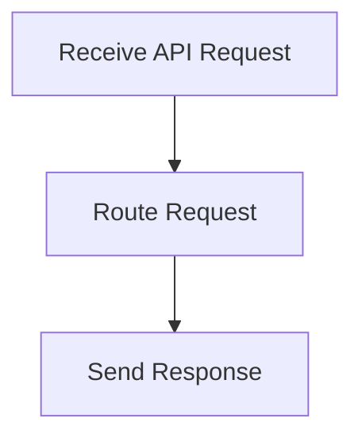

# API Request Handling Flow

> Processes incoming API requests, routing them to the appropriate handlers and returning responses based on the request type.

**Trigger:** API request received  
**Source files:** src/api/routes.ts  

## Flowchart

## Steps

### 1. Receive API Request

Listens for incoming API requests from clients.

### 2. Route Request

Determines the appropriate handler for the request.

### 3. Send Response

Returns the result of the request processing to the client.

