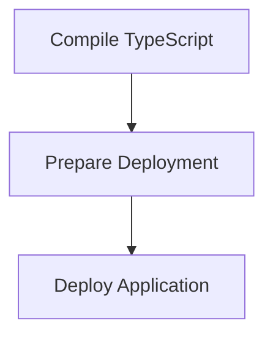

# Build and Deploy Process

> Compiles the TypeScript code into JavaScript and prepares the application for deployment. This process ensures that the latest changes are reflected in the deployed version.

**Trigger:** Build command execution  
**Source files:** package.json, tsconfig.json  

## Flowchart

## Steps

### 1. Compile TypeScript

Uses the TypeScript compiler to convert .ts files into .js files.

### 2. Prepare Deployment

Organizes the compiled files and prepares them for deployment.

### 3. Deploy Application

Deploys the application to the specified environment.

