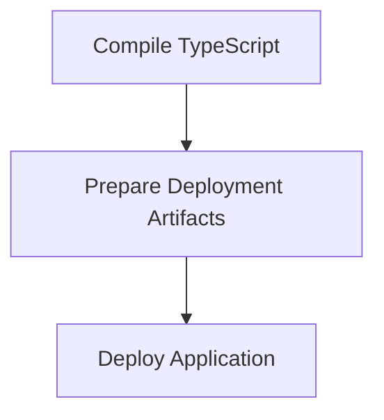

# Build and Deploy Process

> This process compiles the TypeScript code into JavaScript and prepares the application for deployment. It ensures that the latest changes are included in the build before deployment.

**Trigger:** Build command execution  
**Source files:** package.json, tsconfig.json  

## Flowchart

## Steps

### 1. Compile TypeScript

Run the TypeScript compiler to generate JavaScript files.

### 2. Prepare Deployment Artifacts

Package the necessary files for deployment.

### 3. Deploy Application

Deploy the application to the specified environment.

