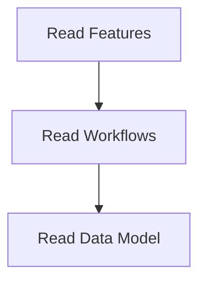

# Data Loading Process

> Loads necessary data files into the system for processing and analysis. This includes features, workflows, and data models.

**Trigger:** Server initialization  
**Source files:** scripts/enrich-graph.mjs, src/instance/index.ts  

## Flowchart

## Steps

### 1. Read Features

Loads feature data from the features.json file.

### 2. Read Workflows

Loads workflow data from the workflows.json file.

### 3. Read Data Model

Loads data model information from the data_model.json file.

