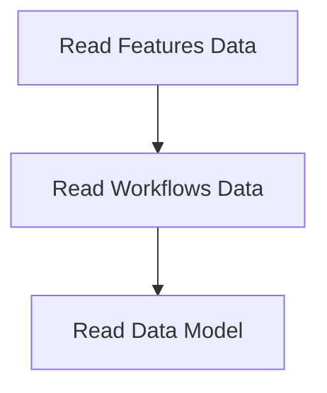

# Data Loading Process

> This process loads necessary data from JSON files into the application's memory, preparing it for processing and interaction. It ensures that all required data structures are populated before user interactions begin.

**Trigger:** Server startup  
**Source files:** src/instance/index.ts, src/utils/cache.ts  

## Flowchart

## Steps

### 1. Read Features Data

Load features data from features.json file.

### 2. Read Workflows Data

Load workflows data from workflows.json file.

### 3. Read Data Model

Load data model definitions from data_model.json file.

