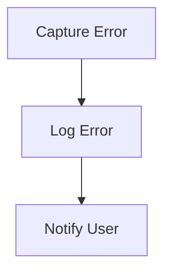

# Error Handling Flow

> Handles errors that occur during the execution of commands or processes, providing feedback to the user and logging the error.

**Trigger:** Error occurrence  
**Source files:** src/utils/errors.ts  

## Flowchart

## Steps

### 1. Capture Error

Detects and captures the error that has occurred.

### 2. Log Error

Logs the error details for further analysis.

### 3. Notify User

Provides feedback to the user regarding the error.

