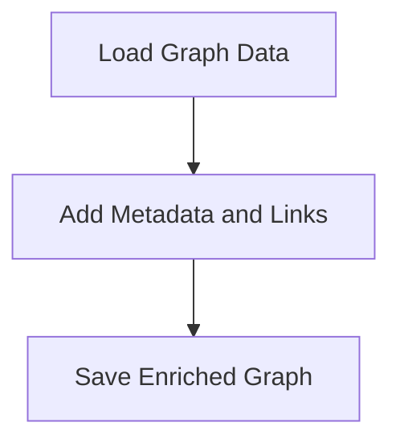

# GraphEnrichmentFlow

> This flow enriches the knowledge graph with additional metadata, links, and keywords to enhance its capabilities.

**Trigger:** Graph enrichment command  
**Source files:** scripts/enrich-graph.mjs  

## Flowchart

## Steps

### 1. Load Graph Data

Retrieves existing graph data from the specified files.

### 2. Add Metadata and Links

Incorporates additional metadata and cross-links into the graph.

### 3. Save Enriched Graph

Writes the enriched graph data back to the appropriate files.

