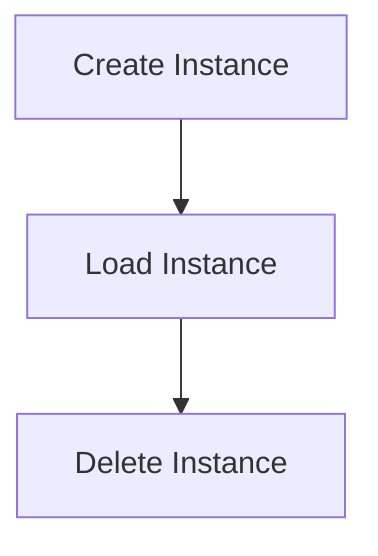

# Instance Management Flow

> Manages the lifecycle of instances within the DreamGraph environment, including creation, loading, and deletion of instances.

**Trigger:** Instance command execution  
**Source files:** src/instance/index.ts  

## Flowchart

## Steps

### 1. Create Instance

Creates a new instance based on user specifications.

### 2. Load Instance

Loads an existing instance from storage.

### 3. Delete Instance

Removes an instance from the environment.

