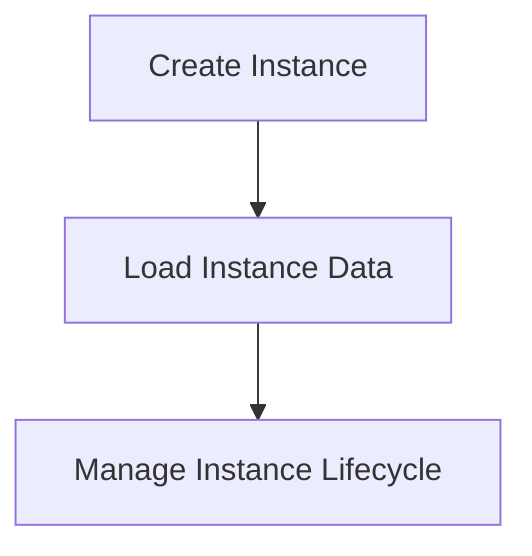

# Instance Management Process

> This process manages different instances of the application, allowing for isolation and management of multiple environments.

**Trigger:** Instance creation or modification  
**Source files:** src/instance/index.ts, src/instance/lifecycle.ts  

## Flowchart

## Steps

### 1. Create Instance

Initialize a new instance of the application.

### 2. Load Instance Data

Load necessary data for the created instance.

### 3. Manage Instance Lifecycle

Handle the lifecycle events of the instance.

