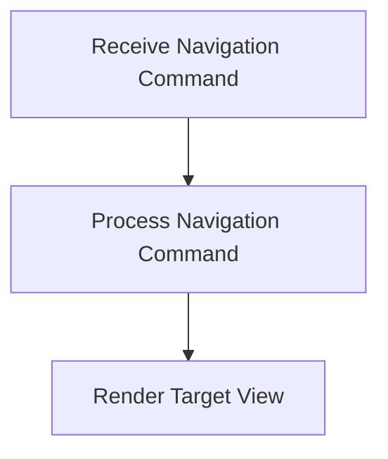

# Navigation Flow

> Facilitates navigation within the application, allowing users to move between different views and functionalities.

**Trigger:** User navigation command  
**Source files:** src/server/dashboard.ts  

## Flowchart

## Steps

### 1. Receive Navigation Command

Listens for user commands related to navigation.

### 2. Process Navigation Command

Processes the command to determine the target view.

### 3. Render Target View

Displays the requested view to the user.

