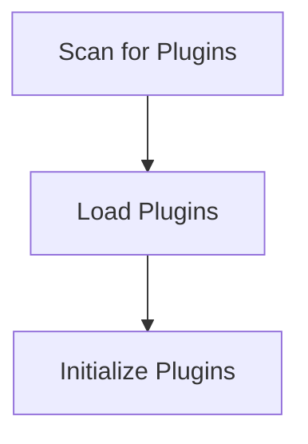

# Plugin Discovery Process

> Identifies and loads available plugins/extensions that can enhance the functionality of the DreamGraph application.

**Trigger:** Server startup  
**Source files:** src/extensions/  

## Flowchart

## Steps

### 1. Scan for Plugins

Scans the extensions directory for available plugins.

### 2. Load Plugins

Loads the identified plugins into the application.

### 3. Initialize Plugins

Initializes the loaded plugins to make them ready for use.

