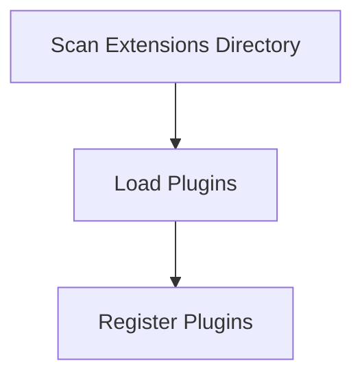

# Plugin Discovery Process

> This process identifies and loads available plugins/extensions for the DreamGraph server. It enhances the server's capabilities by integrating additional functionalities through plugins.

**Trigger:** Server startup  
**Source files:** src/extensions/register.ts  

## Flowchart

## Steps

### 1. Scan Extensions Directory

Identify all available plugins in the extensions directory.

### 2. Load Plugins

Load and initialize each discovered plugin.

### 3. Register Plugins

Register the loaded plugins with the server for use.

