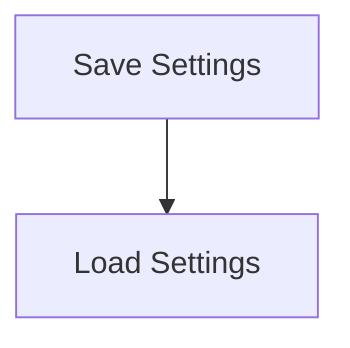

# Settings Persistence Flow

> Manages the saving and loading of user settings and configurations, ensuring that user preferences are retained across sessions.

**Trigger:** User settings change  
**Source files:** src/config/config.ts  

## Flowchart

## Steps

### 1. Save Settings

Saves the current user settings to a configuration file.

### 2. Load Settings

Loads user settings from the configuration file at startup.

