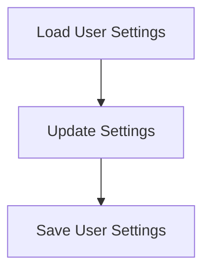

# Settings Persistence Process

> This process manages the saving and loading of user settings and configurations, ensuring that user preferences are retained across sessions.

**Trigger:** User modifies settings  
**Source files:** src/config/config.ts  

## Flowchart

## Steps

### 1. Load User Settings

Read user settings from a configuration file.

### 2. Update Settings

Allow users to modify settings and save changes.

### 3. Save User Settings

Persist updated settings back to the configuration file.

