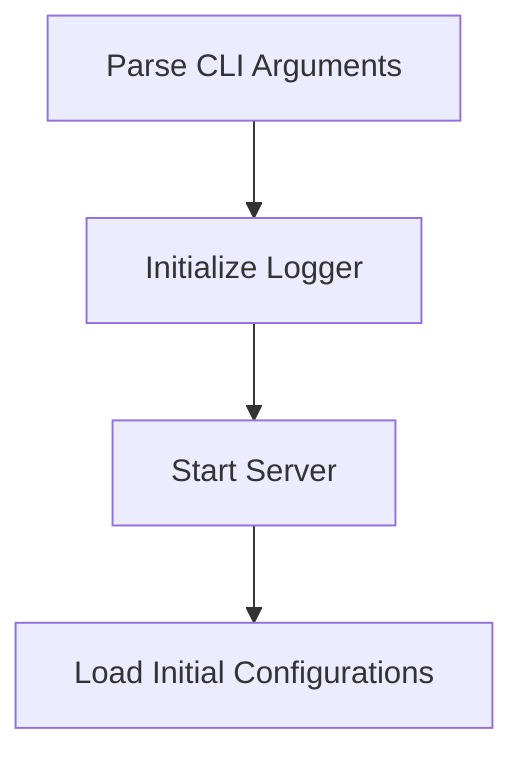

# Startup Initialization Process

> This process initializes the DreamGraph MCP server, setting up necessary configurations and starting the server based on the specified transport mode. It prepares the environment for user interactions and data processing.

**Trigger:** Server start command  
**Source files:** src/index.ts, src/server/server.ts, src/cognitive/llm.ts  

## Flowchart

## Steps

### 1. Parse CLI Arguments

Parse command-line arguments to determine transport mode and port.

### 2. Initialize Logger

Set up the logging system for tracking server operations.

### 3. Start Server

Launch the server in the specified transport mode.

### 4. Load Initial Configurations

Load necessary configurations and initialize components.

