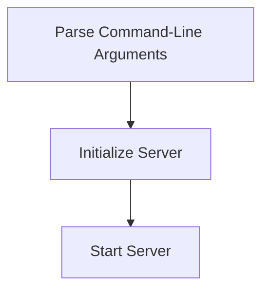

# Startup Process

> This process initializes the DreamGraph server, setting up necessary configurations and starting the server in the specified transport mode. It handles command-line arguments to determine the transport type and port.

**Trigger:** Server launch  
**Source files:** src/index.ts  

## Flowchart

## Steps

### 1. Parse Command-Line Arguments

Extracts transport mode and port from the command-line arguments.

### 2. Initialize Server

Sets up the server based on the parsed transport mode.

### 3. Start Server

Begins listening for incoming requests on the specified port.

