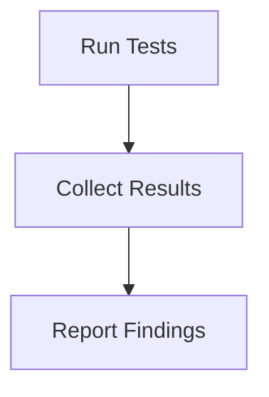

# Testing Process

> Runs automated tests to ensure the integrity and functionality of the application. This includes unit tests, integration tests, and end-to-end tests.

**Trigger:** Test command execution  
**Source files:** tests/instance-isolation.test.ts, vitest.config.ts  

## Flowchart

## Steps

### 1. Run Tests

Executes the defined test cases against the application.

### 2. Collect Results

Gathers results from the test execution.

### 3. Report Findings

Reports the outcomes of the tests to the user.

