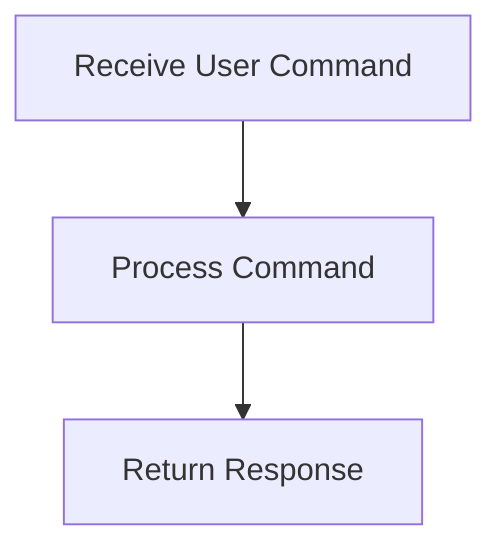

# User Interaction Flow

> Handles user interactions through the command-line interface or HTTP requests. It processes commands and returns appropriate responses.

**Trigger:** User command input  
**Source files:** src/api/routes.ts, src/cli/dg.ts  

## Flowchart

## Steps

### 1. Receive User Command

Listens for user commands via CLI or HTTP.

### 2. Process Command

Processes the received command and executes the corresponding logic.

### 3. Return Response

Sends back the result of the command execution to the user.

