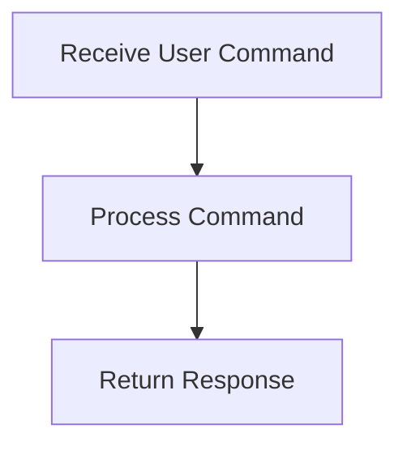

# User Interaction Process

> This process handles interactions from users through the command line or HTTP requests, allowing users to interact with the DreamGraph server and perform various operations.

**Trigger:** User command or API request  
**Source files:** src/api/routes.ts, src/cli/dg.ts  

## Flowchart

## Steps

### 1. Receive User Command

Listen for commands from the user via CLI or HTTP.

### 2. Process Command

Determine the appropriate action based on the user command.

### 3. Return Response

Send back the result of the command to the user.

