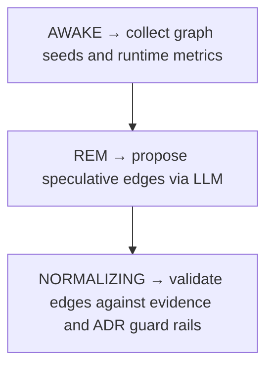

# Dream Cycle

> Primary cognitive workflow that drives speculative discovery and validation across the knowledge graph.

**Trigger:** manual_or_scheduled  

## Flowchart

## Steps

### 1. AWAKE → collect graph seeds and runtime metrics

### 2. REM → propose speculative edges via LLM

### 3. NORMALIZING → validate edges against evidence and ADR guard rails

