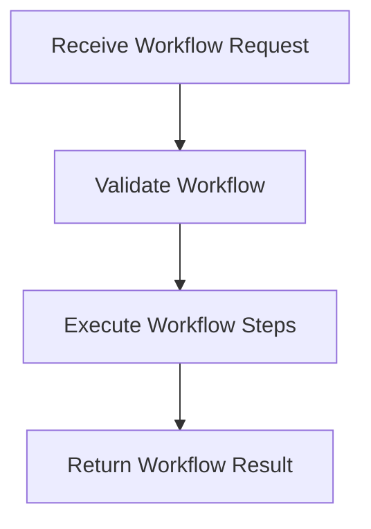

# Workflow Execution Process

> This process executes defined workflows within the DreamGraph server, coordinating the various steps involved in a workflow. It ensures that workflows are carried out efficiently and correctly.

**Trigger:** User initiates a workflow  
**Source files:** src/cognitive/engine.ts, src/api/routes.ts  

## Flowchart

## Steps

### 1. Receive Workflow Request

Capture the request to execute a specific workflow.

### 2. Validate Workflow

Check if the requested workflow is valid and can be executed.

### 3. Execute Workflow Steps

Carry out each step of the workflow in sequence.

### 4. Return Workflow Result

Provide the results of the workflow execution back to the user.

