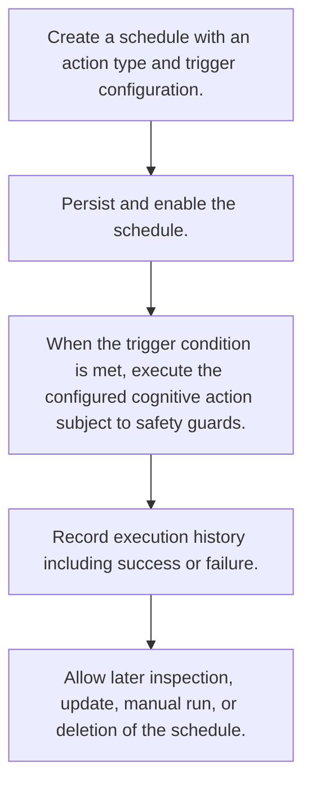

# Scheduled Cognitive Execution

> Automates recurring cognitive actions like dream cycles, nightmare scans, metacognitive analysis, and narrative updates according to temporal triggers.

**Trigger:**   
**Source files:** src/cognitive/scheduler.ts, src/cognitive/register.ts  

## Flowchart

## Steps

### 1. Create a schedule with an action type and trigger configuration.

### 2. Persist and enable the schedule.

### 3. When the trigger condition is met, execute the configured cognitive action subject to safety guards.

### 4. Record execution history including success or failure.

### 5. Allow later inspection, update, manual run, or deletion of the schedule.

