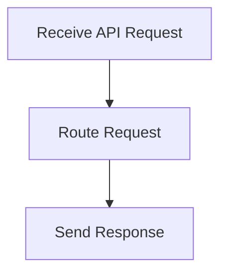

# API Request Handling Flow

> This workflow processes incoming API requests, routing them to the appropriate handlers and returning responses. It manages the interaction between the application and external clients.

**Trigger:** Incoming API request  
**Source files:** src/api/routes.ts  

## Flowchart

## Steps

### 1. Receive API Request

Capture the incoming request from the client.

### 2. Route Request

Determine the appropriate handler for the request.

### 3. Send Response

Return the response to the client based on the request processing.

