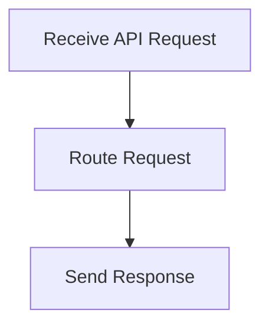

# API Request Handling Process

> This process manages incoming API requests, routing them to the appropriate handlers and returning responses to clients.

**Trigger:** Incoming API request  
**Source files:** src/api/routes.ts  

## Flowchart

## Steps

### 1. Receive API Request

Listen for incoming API requests.

### 2. Route Request

Determine the appropriate handler for the request.

### 3. Send Response

Return the result of the request to the client.

