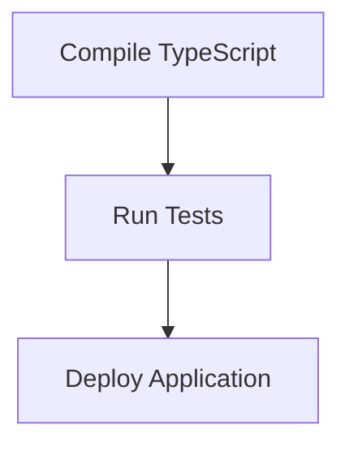

# Build and Deploy Process

> This workflow automates the build and deployment of the DreamGraph application, ensuring that the latest code changes are compiled and deployed to the server environment.

**Trigger:** Build command execution  
**Source files:** package.json, tsconfig.json  

## Flowchart

## Steps

### 1. Compile TypeScript

Run the TypeScript compiler to generate JavaScript files.

### 2. Run Tests

Execute tests to ensure code quality and functionality.

### 3. Deploy Application

Deploy the compiled application to the server.

