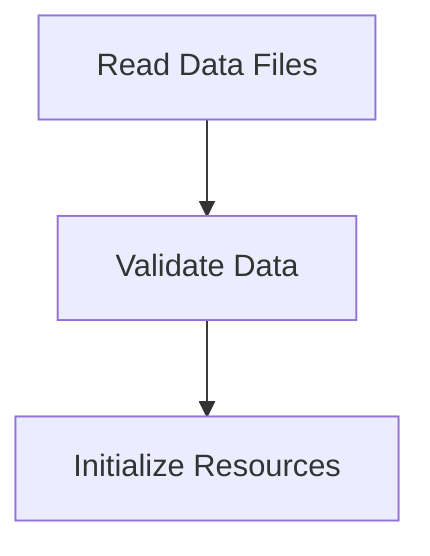

# Data Loading Process

> This workflow manages the loading of data from JSON files into the application, ensuring that all necessary resources are available for processing. It handles reading, parsing, and validating the data files.

**Trigger:** Application startup or data refresh  
**Source files:** src/utils/cache.ts, scripts/enrich-graph.mjs  

## Flowchart

## Steps

### 1. Read Data Files

Load data from specified JSON files into memory.

### 2. Validate Data

Check the integrity and format of the loaded data.

### 3. Initialize Resources

Set up application resources based on the loaded data.

