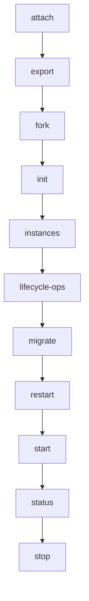

# Commands Flow

> Commands — 11 source file(s): src/cli/commands/attach.ts, src/cli/commands/export.ts, src/cli/commands/fork.ts, src/cli/commands/init.ts, src/cli/commands/instances.ts, src/cli/commands/lifecycle-ops.ts, src/cli/commands/migrate.ts, src/cli/commands/restart.ts, src/cli/commands/start.ts, src/cli/commands/status.ts, src/cli/commands/stop.ts

**Trigger:** Source: src/cli/commands/attach.ts  
**Source files:** src/cli/commands/attach.ts, src/cli/commands/export.ts, src/cli/commands/fork.ts, src/cli/commands/init.ts, src/cli/commands/instances.ts, src/cli/commands/lifecycle-ops.ts, src/cli/commands/migrate.ts, src/cli/commands/restart.ts, src/cli/commands/start.ts, src/cli/commands/status.ts, src/cli/commands/stop.ts  

## Flowchart

## Steps

### 1. attach

Implemented in src/cli/commands/attach.ts

### 2. export

Implemented in src/cli/commands/export.ts

### 3. fork

Implemented in src/cli/commands/fork.ts

### 4. init

Implemented in src/cli/commands/init.ts

### 5. instances

Implemented in src/cli/commands/instances.ts

### 6. lifecycle-ops

Implemented in src/cli/commands/lifecycle-ops.ts

### 7. migrate

Implemented in src/cli/commands/migrate.ts

### 8. restart

Implemented in src/cli/commands/restart.ts

### 9. start

Implemented in src/cli/commands/start.ts

### 10. status

Implemented in src/cli/commands/status.ts

### 11. stop

Implemented in src/cli/commands/stop.ts

