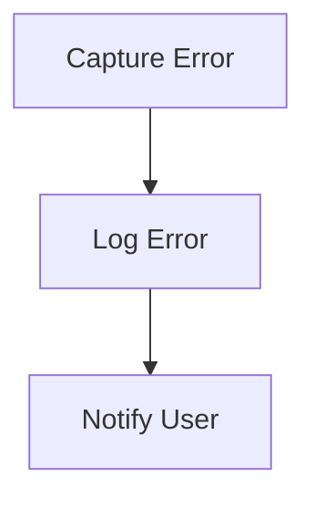

# Error Handling Flow

> This workflow manages errors that occur during application execution, providing feedback to users and logging issues for further analysis. It ensures that the application can recover gracefully from errors.

**Trigger:** Error occurrence  
**Source files:** src/utils/errors.ts, src/utils/logger.ts  

## Flowchart

## Steps

### 1. Capture Error

Detect and capture the error that has occurred.

### 2. Log Error

Record the error details for debugging and analysis.

### 3. Notify User

Provide feedback to the user regarding the error.

