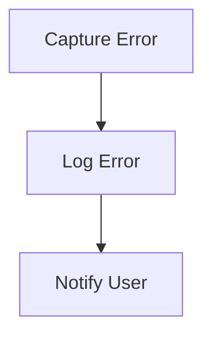

# Error Handling Process

> This process manages errors that occur within the application, ensuring that users receive appropriate feedback and that the application remains stable.

**Trigger:** Error occurrence  
**Source files:** src/utils/errors.ts  

## Flowchart

## Steps

### 1. Capture Error

Listen for errors that occur during application execution.

### 2. Log Error

Log the error details for debugging purposes.

### 3. Notify User

Provide feedback to the user regarding the error.

