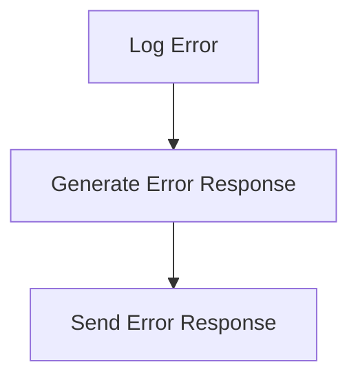

# Error Handling Flow

> This flow manages errors that occur during the operation of the DreamGraph server. It ensures that errors are logged and appropriate responses are sent to users, maintaining application stability.

**Trigger:** An error occurs during processing  
**Source files:** src/utils/errors.ts, src/utils/logger.ts  

## Flowchart

## Steps

### 1. Log Error

Capture the error details and log them for analysis.

### 2. Generate Error Response

Create a user-friendly error message to return.

### 3. Send Error Response

Return the error message to the user.

