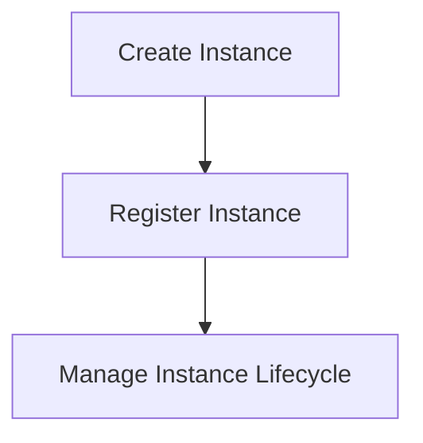

# Instance Management Flow

> This workflow oversees the creation, registration, and management of instances within the DreamGraph application. It ensures that instances are properly initialized and maintained throughout their lifecycle.

**Trigger:** Instance creation request  
**Source files:** src/instance/index.ts, src/instance/lifecycle.ts  

## Flowchart

## Steps

### 1. Create Instance

Initialize a new instance based on user specifications.

### 2. Register Instance

Add the new instance to the system registry.

### 3. Manage Instance Lifecycle

Handle the lifecycle events of the instance, including updates and deletions.

