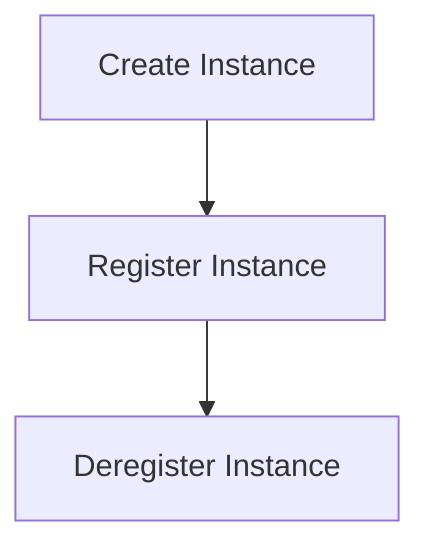

# Instance Management Process

> This process manages the lifecycle of instances within the DreamGraph server, including creation, registration, and deregistration. It ensures that instances are correctly handled throughout their lifecycle.

**Trigger:** User creates or modifies an instance  
**Source files:** src/instance/index.ts, src/instance/lifecycle.ts  

## Flowchart

## Steps

### 1. Create Instance

Initialize a new instance with specified parameters.

### 2. Register Instance

Add the new instance to the master registry.

### 3. Deregister Instance

Remove an instance from the registry when it is no longer needed.

