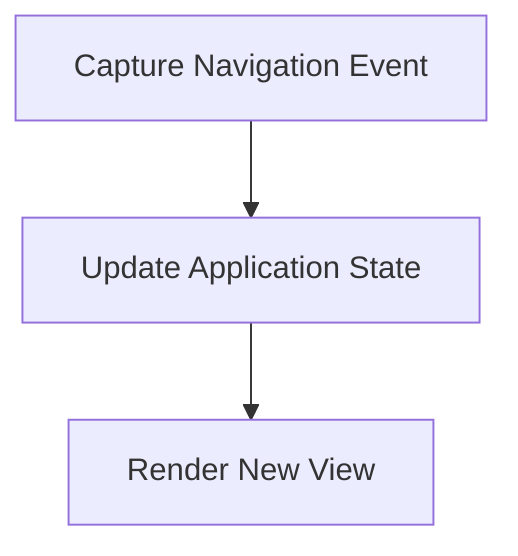

# Navigation Flow

> This workflow handles navigation within the application, allowing users to move between different views and functionalities. It manages the context and state during navigation events.

**Trigger:** User navigation action  
**Source files:** src/server/dashboard.ts  

## Flowchart

## Steps

### 1. Capture Navigation Event

Detect when a user initiates a navigation action.

### 2. Update Application State

Change the application state based on the navigation context.

### 3. Render New View

Display the new view or content to the user.

