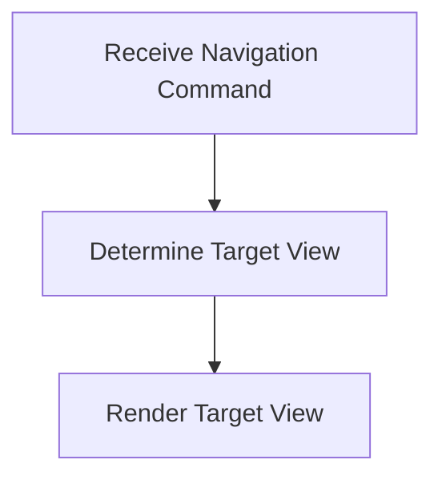

# Navigation Process

> This process handles navigation within the application, allowing users to move between different views and functionalities.

**Trigger:** User navigation command  
**Source files:** src/server/dashboard.ts  

## Flowchart

## Steps

### 1. Receive Navigation Command

Listen for navigation commands from the user.

### 2. Determine Target View

Identify the target view based on the navigation command.

### 3. Render Target View

Display the selected view to the user.

