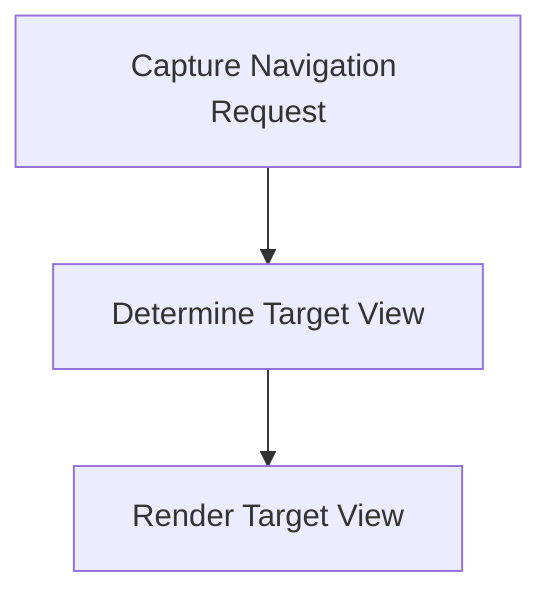

# Navigation Flow

> This flow handles user navigation within the DreamGraph interface, allowing users to move between different views and functionalities. It ensures a seamless user experience while interacting with the application.

**Trigger:** User navigates through the interface  
**Source files:** src/server/dashboard.ts  

## Flowchart

## Steps

### 1. Capture Navigation Request

Detect when a user attempts to navigate to a different section.

### 2. Determine Target View

Identify the target view based on the user's request.

### 3. Render Target View

Display the requested view to the user.

