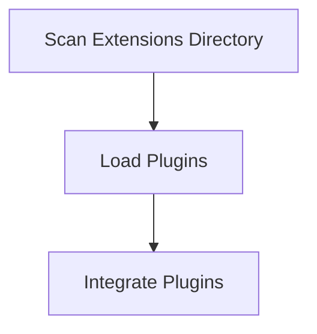

# Plugin Discovery Process

> This workflow identifies and loads available plugins/extensions for the DreamGraph application, enhancing its capabilities and functionality. It scans for compatible plugins and integrates them into the system.

**Trigger:** Application startup  
**Source files:** src/extensions/register.ts  

## Flowchart

## Steps

### 1. Scan Extensions Directory

Look for available plugins in the extensions directory.

### 2. Load Plugins

Initialize and register the found plugins with the application.

### 3. Integrate Plugins

Make the plugins available for use within the application.

