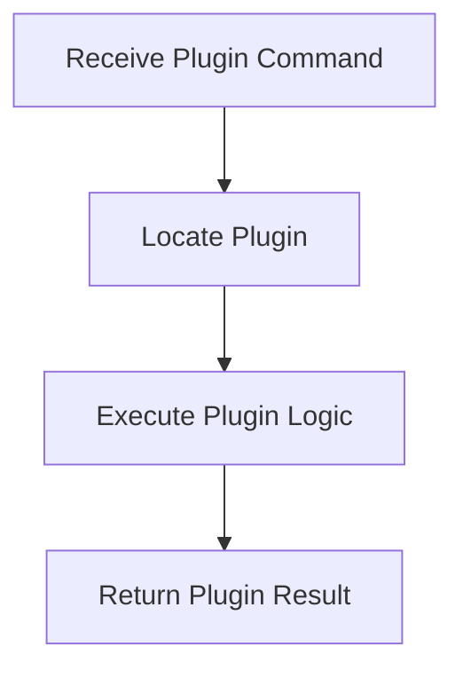

# Plugin Execution Flow

> This workflow manages the execution of plugins within the DreamGraph system, allowing users to leverage additional functionalities provided by plugins.

**Trigger:** Plugin command execution  
**Source files:** src/tools/runtime-senses.ts, src/extensions/vscode/src/commands.ts  

## Flowchart

## Steps

### 1. Receive Plugin Command

Capture the command intended for a plugin.

### 2. Locate Plugin

Identify the appropriate plugin to execute.

### 3. Execute Plugin Logic

Run the logic defined in the plugin.

### 4. Return Plugin Result

Send the result of the plugin execution back to the user.

