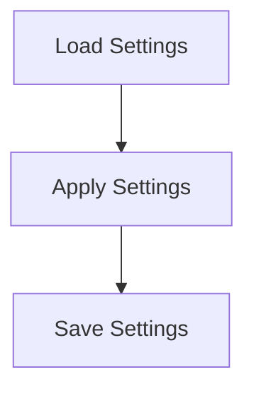

# Settings Persistence Flow

> This workflow manages the saving and loading of user settings and configurations, ensuring that preferences are retained across sessions. It handles reading from and writing to configuration files.

**Trigger:** User settings change or application startup  
**Source files:** src/config/config.ts  

## Flowchart

## Steps

### 1. Load Settings

Read user settings from the configuration file.

### 2. Apply Settings

Apply the loaded settings to the application.

### 3. Save Settings

Write any changes made to settings back to the configuration file.

