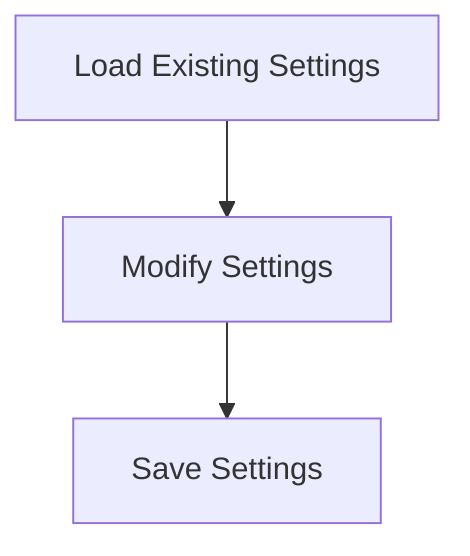

# Settings Persistence Process

> This process manages the saving and loading of user settings and configurations. It ensures that user preferences are retained across sessions and can be modified as needed.

**Trigger:** User modifies settings  
**Source files:** src/config/config.ts  

## Flowchart

## Steps

### 1. Load Existing Settings

Read user settings from the configuration file.

### 2. Modify Settings

Allow the user to change settings through the interface.

### 3. Save Settings

Write the modified settings back to the configuration file.

