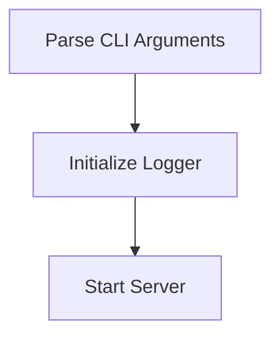

# Startup Process

> This workflow initializes the DreamGraph server, setting up necessary configurations and starting the server in the specified transport mode. It prepares the application for incoming requests and ensures all components are ready to operate.

**Trigger:** Server launch  
**Source files:** src/index.ts, src/server/server.ts  

## Flowchart

## Steps

### 1. Parse CLI Arguments

Parse command line arguments to determine transport mode and port.

### 2. Initialize Logger

Set up logging mechanisms for the application.

### 3. Start Server

Launch the server based on the specified transport mode.

