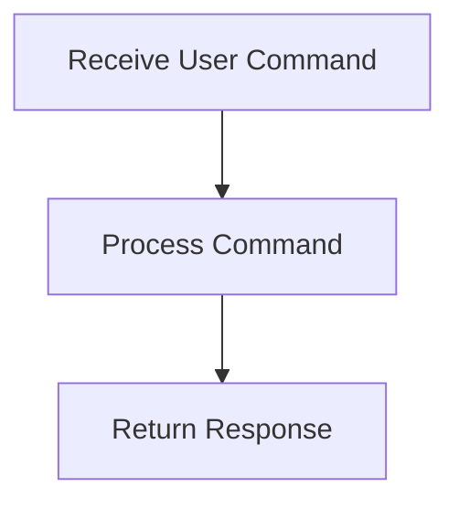

# User Interaction Flow

> This workflow handles user interactions through the CLI or HTTP API, processing commands and returning appropriate responses. It manages the communication between the user and the application.

**Trigger:** User command input  
**Source files:** src/api/routes.ts, src/cli/dg.ts  

## Flowchart

## Steps

### 1. Receive User Command

Capture the command input from the user.

### 2. Process Command

Interpret and execute the command based on application logic.

### 3. Return Response

Send the result back to the user.

