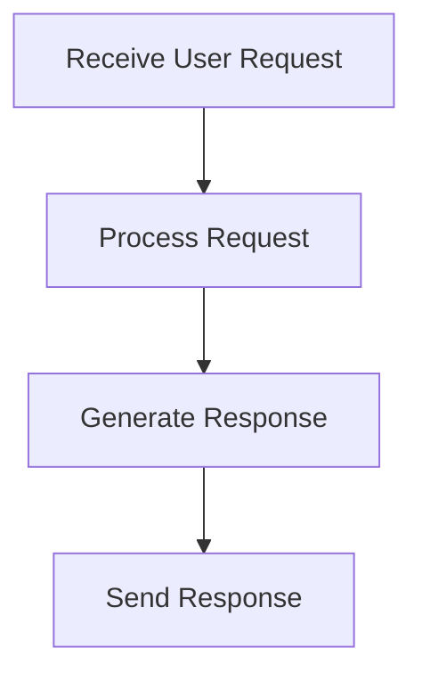

# User Interaction Flow

> This flow handles user interactions with the DreamGraph server, processing requests and returning appropriate responses. It manages the communication between the server and the client, ensuring smooth operation.

**Trigger:** User sends a request via CLI or HTTP  
**Source files:** src/api/routes.ts, src/server/dashboard.ts  

## Flowchart

## Steps

### 1. Receive User Request

Capture the incoming request from the user.

### 2. Process Request

Determine the type of request and route it to the appropriate handler.

### 3. Generate Response

Create a response based on the processed request.

### 4. Send Response

Return the generated response to the user.

