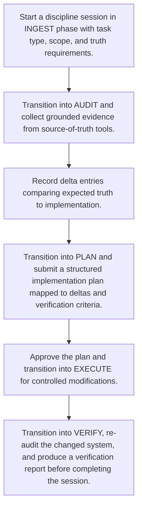

# Discipline Task Lifecycle

> Phase-governed autonomous engineering workflow that ensures evidence-based auditing, planning, execution, and verification for sensitive project changes.

**Trigger:**   
**Source files:** src/discipline/register.ts, src/discipline/state-machine.ts, src/discipline/session.ts, src/discipline/tools.ts  

## Flowchart

## Steps

### 1. Start a discipline session in INGEST phase with task type, scope, and truth requirements.

### 2. Transition into AUDIT and collect grounded evidence from source-of-truth tools.

### 3. Record delta entries comparing expected truth to implementation.

### 4. Transition into PLAN and submit a structured implementation plan mapped to deltas and verification criteria.

### 5. Approve the plan and transition into EXECUTE for controlled modifications.

### 6. Transition into VERIFY, re-audit the changed system, and produce a verification report before completing the session.

