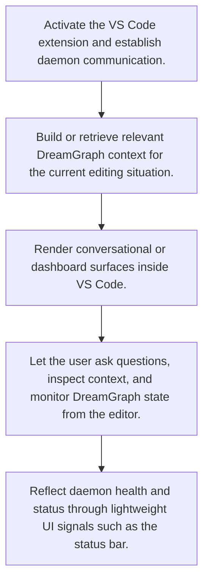

# VS Code Assisted Reasoning

> Brings DreamGraph context into the editor through extension-hosted panels, status indicators, daemon communication, and contextual prompt building.

**Trigger:**   
**Source files:** extensions/vscode/src/extension.ts, extensions/vscode/src/chat-panel.ts, extensions/vscode/src/context-builder.ts, extensions/vscode/src/daemon-client.ts  

## Flowchart

## Steps

### 1. Activate the VS Code extension and establish daemon communication.

### 2. Build or retrieve relevant DreamGraph context for the current editing situation.

### 3. Render conversational or dashboard surfaces inside VS Code.

### 4. Let the user ask questions, inspect context, and monitor DreamGraph state from the editor.

### 5. Reflect daemon health and status through lightweight UI signals such as the status bar.

